# UI設計書（現状の実装から起こしたもの）

デザインを見直すための材料として、**今動いているUIをコードと実機から書き起こした**文書です。
内部設計（データ・ステート・プロンプト・API）は [SPEC_v2.md](./SPEC_v2.md) が担当し、ここでは扱いません。

---

## 0. この文書について

| 項目 | 内容 |
|---|---|
| 対象 | `client/`（React + Vite の PWA）。最初はコミット `720cadc` 時点で書き起こし、デザイン見直し（`REDESIGN_PLAN.md` のフェーズ0〜5）を反映して更新した |
| 向き | 画面・UI中心。「今どう見えているか」「何を押すと何が起きるか」 |
| 読み手 | デザイナー、または Claude Design / Claude のプロジェクト |
| 画像 | `docs/screens/*.png`（87枚、合計約12MB）。本文から相対パスで参照 |

### 「事実」と「気づき」を分ける

- **1〜6章は事実だけ**です。ラベルの文言・数値・色はコードから一字一句写しています。意図の推測や理想像は混ぜていません。
- **7章は「気づき」**です。デザインを検討するときの論点を、**実測または根拠（ファイル:行）つき**で並べています。直したものは「修正済み」と付け、何をどう直したかを書き添えています。
- 7章の各項目には確度を付けています。**【実測】**=ブラウザで測って確かめた、**【画像】**=スクリーンショットで目視確認した、**【コード】**=コードの読み取りのみ（動かして確かめていない）。

### スクリーンショットの撮影条件

- 画面サイズ **390×844、DPR 2**（iPhone 系の縦画面を想定）。デスクトップ幅の4枚だけ 1280×800。
- ブラウザは Chromium（Playwright）。**書体は同梱の woff2 を使っています**（OSの書体には依存しません）。
- データは撮影用に作った**架空のサンプル**です（世界「桜坂学園」、キャラ ミナ・トビー・先生・ハル・リラ ほか）。画像は絵の代わりに単色のイラストを使っています。
- 返答はモックのLLMが返したもので、実際のモデルの出力ではありません。ストリーミング中の1枚（`chat-18`）も、通常の通信のまま撮っています。
- 画像は撮った時点のものです。見た目を変えたら撮り直しが必要です。撮影スクリプトはリポジトリに入れていません（Playwright が依存に無いため）。

---

## 1. UIに効く前提と、UIが守っている制約

### 1.1 前提

- **個人用の単一ユーザー**のPWA。自分のVPSに置いて、主にスマホで使う。ユーザー管理・共有の画面は無い。
- **UIは全部日本語**。英語は一部の画面の小見出し（`Characters`・`Game Time` など）と、モデル名・ID にだけ出る。設定画面の小見出しは日本語。
- 見た目は**白地に淡い暖色（クリーム・オレンジ）**で、角丸が多い。枠線は極細のヘアラインだけで、面は塗りで表現する。
- **ビジュアルノベル風**。会話は吹き出し、地の文（ナレーション）は吹き出しの外に出す。
- **スマホ前提のレイアウト。** 移動は**下部タブ**（最上位の5画面）と、各画面の「戻る」。PC幅（761px以上）では、同じ画面を**幅760pxの列**にして中央に置く（PC専用のレイアウトは持たない。3.9）。
- 暗い配色（ダークモード）は無い。

### 1.2 UIが守っている制約（コード中に理由が書いてあるもの）

| 制約 | 内容 |
|---|---|
| 削除・アーカイブは会話一覧に置かない | 誤操作を避けるため、会話を**開いた状態の右上 ⋯**からだけ行う |
| 取り消せない操作は確認を取る | アプリの見た目の確認ダイアログ（4.4）。実行ボタンは「削除する」のように動詞で書き、取り消せないものは赤地 |
| 吹き出し幅を揃える | 1メッセージが複数の吹き出しでも、操作列（⋯・候補の切替）は**最後の行にだけ**付け、他の行には空の列を置いて幅を揃える |
| 生成中も完成時と同じ形 | 流れてくる本文を、保存時と同じ規則（`shared/utterances.ts`）で話者ごとの吹き出しに分ける。送った発言は送信した瞬間に出す |
| ステートバーは最新の状態だけ | 日付・曜日・時刻・場所・天候。季節は出さない（プロンプト側に出る） |
| セリフと地の文を色と大きさで分ける | 「」で囲まれた部分がセリフ（基準サイズ・濃い色）、それ以外が地の文（0.94倍・少し淡い色）。表示のとき「」自体は消す |
| ナレーションは吹き出しにしない | ハート付きの独立した行にする |
| 場面転換は吹き出しにしない | 区切り線として出す。再生成・分岐・編集は出さず、取り消し（ゴミ箱）だけ |
| 一時指示は消し忘れを防ぐ | 設定中は入力欄の真上に**常に1行で**出し、×で外せる |
| APIキーは画面に出さない | 接続先の一覧には末尾4文字（`key_hint`）と「キー未設定」だけ。編集画面のキー欄は常に空で開く |
| 解釈できない入力は黙って捨てない | 時刻入力は「時刻として読み取れません（例: 16:00）」、暦は保存を通したうえで「確認したい点」を出す |
| 暦に無い季節も隠さない | ロアの季節トリガーに残っていれば「（暦に無し）」と点線で見せる |
| 画像は容量を必ず添える | アルバムは枚数とサイズを常に出す（整理が目的の画面） |
| 消える操作だけ色で区別する | メモリー整理案のプレビューは、削除=赤・注入オフ=灰・追加=オレンジの左線 |
| 効いている値は隠さない | 設定で、親のトグルがOFFでも使われ続ける値（要約のきっかけ・1ターンのイベント上限・オートプレイの最大ターン）は字下げも非表示もしない |

---

## 2. 情報構造とナビゲーション

### 2.1 画面マップ

```
ログイン（APP_PASSWORD があるときだけ。未認証のとき全画面の代わりに出る）

下部タブ（最上位の5画面にだけ出る）
├ チャット /chats  ── 右下の＋ → 「シナリオを選ぶ」モーダル → 会話
│   ├ 末尾の「アーカイブ N件 ›」 → /chats/archive アーカイブ（戻るあり・タブなし）
│   └ /chats/:id  会話
│       ├ ステートバーをタップ → /chats/:id/state  ステート編集
│       ├ ＋（物語を進める）「あらすじ」 → /chats/:id/summary  あらすじ
│       ├ 右上の ⋯「日記を読む」 → /chats/:id/diary  日記
│       └ （モーダル類は 5.4 に一覧）
│
├ 世界 /worlds → /worlds/:id  世界の詳細（シナリオ編集モーダル含む）
│   ├ /worlds/:id/lorebook      ロアブック
│   ├ /worlds/:id/locations     場所（エリア編集モーダル含む）
│   ├ /worlds/:id/calendar      暦・天候
│   ├ /worlds/:id/events        イベント
│   ├ /worlds/:id/memory-review メモリーの整理
│   └ /characters/:id  キャラクター編集 → /characters/:id/memories  メモリー
│
├ ペルソナ /personas（一覧と編集は同じURLの中で切り替わる。編集中はタブを出さない）
├ アルバム /album（世界の一覧と、世界ごとのグリッドは同じURLの中で切り替わる。グリッド表示中はタブを出さない）
└ 設定 /settings（入口の一覧＝ハブ）
    ├ /settings/models          モデルと接続先
    ├ /settings/persona         既定のペルソナ
    ├ /settings/system-prompt   共通の指示
    ├ /settings/state           ステート
    ├ /settings/events          イベントと進行フラグ
    ├ /settings/director        裏の台本
    ├ /settings/lorebook        ロアブック
    ├ /settings/summary         あらすじとメモリー → /settings/summary/policy 要約の方針
    ├ /settings/autoplay        オートプレイ
    ├ /settings/snapshot        スナップショット
    └ /settings/budget          文脈の予算
```

- `/` は `/chats` と同じ画面。未定義のURLは「ページが見つかりません」の一文だけ（戻る導線なし）。
- **最上位の5画面は大見出し（`HomeHead`）で、戻るボタンが無い。** それ以外の画面はトップバーに戻るがある。
- **「戻る」の行き先**: 多くの画面は戻り先を固定している（例: 世界の詳細 → 世界の一覧、設定のサブページ → 設定のハブ、要約の方針 → あらすじとメモリー）。ペルソナ編集・アルバムの世界グリッドは**URLが変わらない**ので、画面内の状態を閉じて一覧に戻る。会話画面の戻るは常に `/chats`。
- 画面の読み込み中は「読み込み中…」の一行だけ（スケルトンなどは無い）。

### 2.2 下部タブ

最上位の5画面の下端に出る（`TabBar`）。ボタンは高さ52・5等分、上に1pxのヘアライン、下に 16px＋セーフエリアの余白。アイコン（21px）の下にラベル（10.5px）。選択中はアイコンと文字が `--accent-ink`。

| 順 | アイコン | ラベル | 行き先 |
|---|---|---|---|
| 1 | 吹き出し | チャット | `/chats` |
| 2 | 開いた本 | 世界 | `/worlds` |
| 3 | 人物の書類 | ペルソナ | `/personas` |
| 4 | カメラ | アルバム | `/album` |
| 5 | 歯車 | 設定 | `/settings` |

**会話・詳細・設定のサブページ・ペルソナの編集中・アルバムのグリッド表示中・アーカイブには出さない。**

### 2.3 ＋メニュー（会話の入力欄の左の＋）「物語を進める」

押すと、暗幕の上に**画面下のシート**が重なる（会話を押し上げない）。白・上だけ角丸24・上につまみ・右上に ×。見出しは「物語を進める」。行の高さは60px。暗幕のタップ・Esc・× で閉じる。

| 行（太字） | 補足（小さい字） | 動作 |
|---|---|---|
| オートプレイ | ユーザー入力なしで場面を進める | 設定の最大ターンまで続けて生成。最後が AI の応答でないとき・生成中は無効 |
| 場面を進める | 時間を進める。日付が変われば天候とイベントも動く | 「場面を進める」モーダル（ステートバーの時計と同じ） |
| 一時指示 | その場の描写・状態を補正する（会話には残りません） | 「一時指示」モーダル |
| あらすじ › | これまでの出来事を確認・編集 | `/chats/:id/summary` |

### 2.4 右上の ⋯（この会話のメニュー）

会話のヘッダーのモデルピルの右（44×44、`aria-label`「この会話のメニュー」）。右上に開くポップオーバー（幅248・角丸18）。外側のタップ・Esc で閉じる。

| 順 | 行 | 動作 |
|---|---|---|
| 1 | この会話の設定 | 「この会話の設定」モーダル |
| 2 | 会話の名前を変える | 「会話の名前」モーダル |
| 3 | 日記を読む | `/chats/:id/diary`（5.18）。物語を進める操作ではなく読み物なので、＋メニューではなくここに置く |
| — | 見出し「確認する」 | |
| 4 | プロンプトを確認 | 「プロンプトの確認」モーダル |
| 5 | メモリー候補を確認 | 「メモリー候補」モーダル |
| — | 区切り線 | |
| 6 | 会話を書き出す | JSON をダウンロード |
| 7 | アーカイブする ／ アーカイブから戻す | 切替。アーカイブしたら一覧へ戻る |
| 8 | **この会話を削除する**（赤・上に区切り線） | 確認ダイアログのあと削除 |

### 2.5 メッセージの⋯メニュー

各メッセージの右（ユーザー発言は左）の「⋯」（44×36）。ポップオーバー（幅いっぱい・角丸18）。

| 行 | 出る条件 |
|---|---|
| 再生成する | 最後のAI応答で、生成中でないとき |
| 編集する | 常に |
| コピーする | 常に |
| この場面を描く | 設定で画像モデルが入っていて、AIの応答のとき |
| ここから分岐する | 常に |
| **削除する**（赤・上に区切り線） | 常に |

最後のAI応答の脇には、⋯の上に「‹ 3/3 ›」の**候補の切替**も出る（ボタンの高さ32）。最後の候補で › を押すと再生成になる。送信直後の発言と生成中の応答（まだ保存されていないもの）には、⋯ も候補の切替も出さない。

### 2.6 モデルのメニュー（会話のヘッダーのピル）

ピルには現在のモデル名（短縮表示）と ⌄。押すとメニューが開く。1行目は常に「既定（モデル名）」。接続先が2つ以上あるときは、接続先ごとの見出し（`.mgroup`）で区切る。一覧を取れなかった接続先には「モデル一覧を取れませんでした」。選択中は右に ✓。

---

## 3. デザインシステム

### 3.1 色トークン（`client/src/theme.css` の `:root`）

| トークン | 値 | 用途 |
|---|---|---|
| `--bg` | `#ffffff` | 画面の地 |
| `--surface` | `#ffffff` | トップバー・入力欄まわり・固定バー |
| `--surface-2` | `#f7f0e7` | 入力欄・ピル・ステートバー・各種の淡い面 |
| `--border` | `#efe6d9` | ヘアライン（1px） |
| `--text` | `#5b4636` | 本文 |
| `--muted` | `#a88f76` | 補助文字（淡い方）・ユーザー名・空の状態の説明 |
| `--muted-strong` | `#7d6650` | 補助文字（読ませる方） |
| `--accent` | `#e9834b` | 主ボタン・ON・選択 |
| `--accent-2` | `#d8712f` | ⋯がオンのとき・ピン留め |
| `--accent-ink` | `#a8511c` | 淡色面の上のアクセント文字・小見出し |
| `--danger` | `#d9534f` | 削除・停止・エラー |
| `--user-bubble-a` / `-b` | `#f6a874` / `#e9834b` | ユーザー吹き出しのグラデーション（縦） |
| `--char-bubble` | `#f5efe5` | キャラ吹き出し |
| `--char-text` | `#5b4636` | キャラのセリフ |
| `--char-act` | `#7a634e` | キャラ吹き出し内の地の文（見直しで `#a88f76` から濃くした） |
| `--user-text` | `#fffdf9` | ユーザー吹き出しのセリフ。主ボタンの文字にも使う |
| `--user-act` | `rgba(255,255,255,0.82)` | ユーザー吹き出し内の地の文 |
| `--narration` | `#7d6650` | ナレーション文（見直しで `#9c8265` から濃くした） |
| `--narr-icon-bg` / `-fg` | `#f6ddbe` / `#c9873f` | ハート・キャラのアバター下地・大見出しの右のアイコン色・設定のハブの丸アイコンの地 |
| `--avatar-neutral` | `#efe7dc` | アバター下地（無色） |
| `--chevron` | `#c3ae98` | › や ⋯ の色 |
| `--placeholder` | `#a08b78` | プレースホルダ |
| `--field-ink` | `#7d6650` | 入力欄の文字 |

PC幅では、列の外側の地に `--surface-2` を使う（3.9）。

そのほか直書きの色: 入力欄フォーカス時の背景 `#f3ebdf`／チャット一覧のアーカイブの行 `#fbf7f1`／トーストの地 `#5b4636`・文字 `#fffdf9`／FAB の影 `rgba(200,110,40,.32)`／ポップオーバー・モーダルの影 `rgba(90,66,44,.22)`／モーダルの暗幕 `rgba(90,66,44,.32)`／スナップショット上のボタン `rgb(0 0 0 / 38%)`。

### 3.2 書体

| 変数 | スタック | 使い分け |
|---|---|---|
| `--font-ui` | Zen Maru Gothic → Hiragino Sans → Noto Sans JP | 見出し・ボタン・ラベル・ステートバー（丸ゴシック） |
| `--font-body` | Noto Sans JP → Hiragino Sans | 本文・入力欄・吹き出し |
| `--font-meta` | Archivo → system-ui | 英字の小見出し（`.kicker`）・数値（ステッパー・統計）・時刻・モデル名・タグ |

書体は `/fonts/` に同梱（woff2。`fonts.css` から読み込む）。Archivo は日本語を持たないため、日本語を含む行（ステートバー）は `--font-ui` で揃えている。

主なサイズ（px / 太さ）:

| 役割 | 指定 |
|---|---|
| 大見出し `h1`（最上位の5画面） | 23 / 700 `--font-ui`。副題（アルバムの枚数・容量）は 11.5 / 600 |
| トップバーの題 | 18 / 700 `--font-ui` |
| トップバーの副題・`.kicker` | 10 / 600 `--font-meta`、字間 .12em／.18em、**大文字化** |
| 日本語の小見出し `SectionHead`（設定・＋シート） | 12.5 / 700 `--font-ui`、字間 .06em、`--accent-ink` |
| 一覧の名前 `.nm` | 16 / 700（小さい版 14.5） |
| 一覧の世界・シナリオ `.row-meta` | 11.5 / 700、1行、`--accent-ink` |
| 一覧の説明 `.desc` | 12.5 / 400、2行まで（`--muted-strong`） |
| 本文（`body`） | 15 / 400 |
| 吹き出し | 14（地の文は ×0.94）、行間 1.7 |
| ナレーション | 13、行間 1.7 |
| ユーザー名（吹き出しの上） | 11 / 600 |
| ステートバー | 12.5 / 600 |
| 入力欄 | 14（会話の入力欄は 14.5） |
| `.pill` | 15 / 700（`.sm` は 12 / 600） |
| `.tag` | 9.5 / 600 `--font-meta` |
| `.chip` | 12 / 600 |
| `.field > label` | 11.5 / 600 |
| 設定の1行のラベル・説明・単位 | 14.5 / 600 ・ 12 ・ 11 / 500（`--muted-strong`、ラベルのうしろに 6px 空けて） |
| ステッパーの数字 | 15 / 700 `--font-meta` |
| 下部タブのラベル | 10.5 / 600（選択中は 700） |
| 確認ダイアログ | 題 18 / 700・本文 13.5 |

### 3.3 角丸

| 値 | 使われ方 |
|---|---|
| `--r-input` 16px | 入力欄・統計カード・整理案の行・メモリー候補・IDコピー行 |
| `--r-md` 16px | スナップショットの枠・参照画像の見本・warn-list・アルバムのお知らせ・説明の囲み・択一カード |
| `--r-sm` 10px | アルバムのセル・原寸画像 |
| `--r-bubble` 20px | 吹き出し（しっぽ側の角だけ `--r-tail` 6px） |
| 999px / 50% | ピル・チップ・タグ・アバター・FAB・トグル・丸ボタン |
| 24px | 確認ダイアログ・＋シート（上だけ） |
| 22px | モーダル／会話の入力欄（textarea） |
| 20px | 設定のハブの先頭カード |
| 18px | ポップオーバー・モデルメニュー |
| 16px | トースト・ステッパー・アーカイブの行 |
| 14px | 切り替え（Segmented）・比率のボタン |
| 7px / 10px / 8px | チェック／ステッパーの数値欄／エリアのコード欄 |

### 3.4 余白と寸法

- 画面の左右の余白: 一般の画面 18px／会話画面の吹き出し領域 15px（`--chat-pad-x`）。
- 一般の画面の下余白: 28px + セーフエリア。
- トップバー: 上 10px（+セーフエリア）／下 12px／左 8px／右 12px。下に1pxのヘアライン。
- 大見出し: 上 16px（+セーフエリア）／下 14px。幅 360px以下ではアイコン幅を 44→38px に詰める。
- 戻るボタンの無いトップバー（`.topbar.no-back`）: 左 18px。
- 下部タブ: ボタン高さ 52、下 16px + セーフエリア。
- 一覧の行: 上下 14px、行間の区切りは1pxのヘアライン（最後の行は無し）。アバター 50px（`sm` 46／`xs` 38）。
- フォーム画面: 項目間 20px、ラベルと入力 7px。
- 固定バー（`.footbar`）: 上 12px／下 22px + セーフエリア／左右 18px。上に1pxのヘアライン。
- 設定の1行（`.setting`）: 上下 12px、隣り合う行の間にヘアライン。設定のサブページは項目間 24px。

**会話画面のレイアウト変数（14個。コード側のコメントは「13」）**

`--stagger: 20px`／`--chat-pad-x: 15px`／`--avatar-size: 32px`／`--av-gap: 9px`／`--side-w: 44px`／`--side-gap: 8px`／`--msg-gap: 17px`／`--bubble-pad-y: 9px`／`--bubble-pad-x: 13px`／`--bubble-font: 14px`／`--bubble-lh: 1.7`／`--act-scale: 0.94`／`--narr-font: 13px`／`--narr-lh: 1.7`

### 3.5 タップ領域（実測値）

| 要素 | サイズ（px） |
|---|---|
| 大見出しの右のアイコン | 44×44 |
| トップバーのアイコン | 40×40（会話の右上の ⋯ は 44×44） |
| 下部タブのボタン | 78×52（390px幅で5等分） |
| 入力欄の＋・送信 | 44×44 |
| FAB | 56×56 |
| `.pill` | 高さ 48（`.sm` は 34、幅は内容） |
| チップ | 高さ約 26（上下 5px + 12px 文字） |
| トグル | 50×30（当たり判定は疑似要素で高さ 44） |
| ステッパーの −／＋ | 44×44（全体 152×44、数字欄 64） |
| 切り替え（Segmented） | 高さ 48 |
| 確認ダイアログのボタン | 高さ 52・全幅 |
| チェック | 22×22 |
| 一時指示の × | 26×26 |
| ステートバーの時計 | アイコン 20／箱 24（疑似要素で当たり判定 44×44） |
| メッセージの ⋯ | 44×36（候補の ‹ › は高さ 32） |
| ポップオーバーの行 | 高さ 48 |
| ＋シートの行 | 高さ 60 |
| エリア行のボタン | 34×34 |

### 3.6 重なり順（z-index）

| 値 | 要素 |
|---|---|
| 6 | 入力欄・一時指示バー |
| 20 | 下部タブ |
| 30 | FAB |
| 55 | メニューの暗幕（透明。外側タップで閉じる） |
| 60 | ポップオーバー・モデルメニュー |
| 90 | ＋シートとその暗幕 |
| 100 | モーダル |
| 150 | 確認ダイアログ（モーダルの中から開いても上に出る） |
| 200 | トースト |

### 3.7 モーション

- ボタンを押すと 0.98 倍（`:active`）。無効時は不透明度 0.45。
- トグル 0.16秒、＋の回転 0.18秒、＋シートの出現 0.18秒、トースト出現 0.22秒（下から8px）、ストリーミングのキャレット 1秒周期の点滅。
- **`prefers-reduced-motion` への対応は無い。**

### 3.8 コントラスト（WCAG 比の計算値）

AA の基準は本文 4.5、大きな文字（約18px太字以上）3.0。

| 組み合わせ | 比 | 主な使い道 |
|---|---|---|
| `--text` / 白 | 8.85 | 本文 |
| `--text` / `--surface-2` | 7.82 | 入力欄 |
| `--char-text` / `--char-bubble` | 7.73 | キャラのセリフ |
| `--accent-ink` / 白 | 5.44 | 小見出し・リンク |
| `--muted-strong` / 白 ・ `--surface-2` | 5.40 ・ 4.78 | 補助文字（読ませる方） |
| `--accent-ink` / `--surface-2` | 4.81 | モデルピル・統計の数字 |
| `--narration` / 白 | 5.40 | ナレーション文（13px）。見直し前は 3.62 |
| `--char-act` / `--char-bubble` | 4.93 | 吹き出し内の地の文（13.2px）。見直し前は 2.68 |
| `--danger` / 白 ・ 白 / `--danger` | 3.96 ・ 3.96 | 削除の文字・停止ボタン |
| `--placeholder` / 白 ・ `--surface-2` | 3.25 ・ 2.88 | プレースホルダ |
| `--muted` / 白 ・ `--surface-2` | 3.06 ・ 2.71 | ユーザー名・空の状態の説明。一覧の説明は見直しで `--muted-strong`（5.40）に替えた |
| **`--user-text` / ユーザー吹き出しの上端 ・ 下端** | **1.92 ・ 2.65** | **ユーザーのセリフ（14px）。色は見直しでも変えていない** |
| **`--user-act`（82%白）/ ユーザー吹き出し** | **約 1.7 ・ 約 2.3** | **ユーザーの地の文** |
| **白（`--user-text`）/ `--accent`** | **2.65～2.69** | **主ボタン（`.pill.primary`）の文字・選択中チップ・ON のタグ** |
| `--narr-icon-fg` / `--narr-icon-bg` | 2.28 | ハート・キャラのアバター文字（設定のハブの丸アイコンは `--accent-ink` を使う） |
| `--chevron` / 白 | 2.14 | › ・ ⋯ |
| `--accent` / 白 | 2.69 | 入力欄の＋の回転時・チェック（装飾） |

### 3.9 レスポンシブ・セーフエリア・ビューポート

- ブレークポイントは3つ: **761px 以上**で画面を列にする（下記）／**560px 以下**で `.grid-2`（2列のフォーム）が1列になる／**360px 以下**で大見出しの右のアイコンを詰める。
- **PC幅（761px 以上）**: `#root` を幅 760px（`--app-w`）の列にして中央に置き、列の左右に1pxのヘアライン、外側の地は `--surface-2`。会話・一覧・設定・詳細のすべてがこの列の中に収まる。
  画面の端に固定する部品（FAB・右上 ⋯ のメニュー・モデルのメニュー）は、列の左右の余り（`--app-edge`）を足して**列の内側の端**に置く。＋シートは列の幅。モーダル（最大640）・確認ダイアログ（最大420）・トーストは画面の中央。
  スマホ幅では `--app-edge` が 0 になり、見た目は変わらない。

  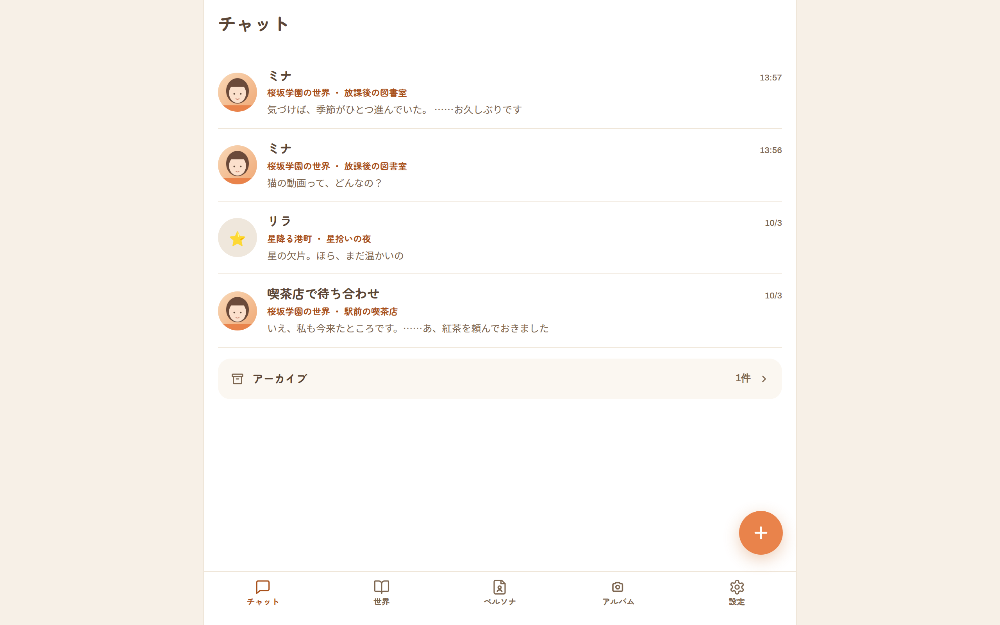 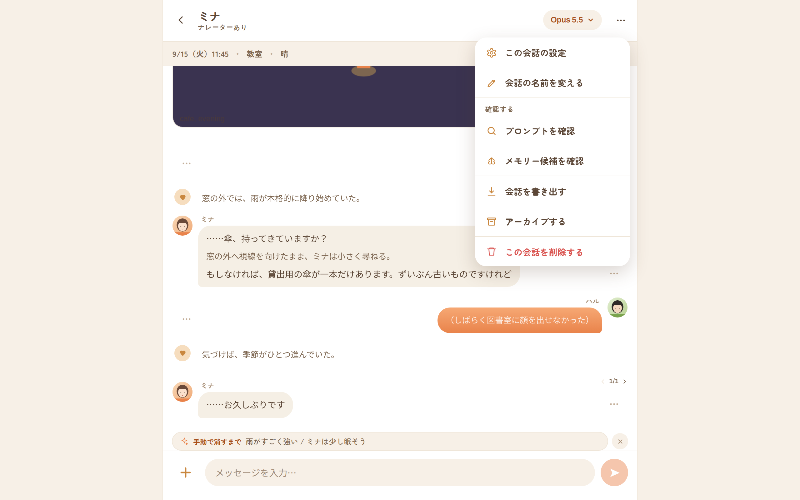
- 高さは `100dvh`（iOS のアドレスバー対策）。`#root` は縦のフレックスで、各画面が上（トップバーか大見出し）・中（`.content` がスクロール）・下（`.footbar`・入力欄・下部タブ）を持つ。
- セーフエリアは**上と下だけ**対応（`env(safe-area-inset-top/bottom)`）。左右は未対応。
- `viewport` は `viewport-fit=cover, maximum-scale=1.0`（ピンチでの拡大不可）。
- ホバー用のスタイルは1箇所（キーワードチップの ×）だけ。

### 3.10 アイコン（43個）

Lucide 準拠のインラインSVG（`client/src/icons.tsx`）。絵文字は使わない（アバターにユーザーが入れた絵文字を除く）。線画（太さ2）が基本で、`send`・`square` などは塗り。サイズは呼び出し側で 10〜20px 程度に指定する。

`back chevL chevR chevD chevU plus minus check x send square dots heart play forward castAdd lines fork copy trash camera refresh brain bubble book bookOpen charFile gear person pin pencil download upload search globe pin2 clock calendar sparkle compass scroll archive home`

（`lines` は設定のハブの「文脈の予算」で使う。`home` は現状どの画面からも使われていない。）

---

## 4. 共通コンポーネント

### 4.1 レイアウト

| 部品 | 構成 | 備考 |
|---|---|---|
| **TopBar** | 戻る（‹）／題（太字）と副題（英字の小さい大文字）／右側の操作 | 戻り先は `back`（URL）か `onBack`（画面内の状態）。省略時は履歴を1つ戻る。`hideBack` で戻るを消せる |
| **HomeHead** | 大見出し（＋任意の副題）と右のアイコン群 | 下部タブの最上位5画面が使う。戻るボタンは無い |
| **TabBar** | 下部タブ（2.2） | 最上位5画面の最下部に置く |
| **`.content`** | スクロール領域 | `.content.form` は項目を縦に並べる（間隔 20px） |
| **footbar** | 画面下に固定の操作バー | 詳細画面は「削除（赤の淡いピル）＋保存（主ボタン・横いっぱい）」の並びが多い。保存ボタンはチェックアイコン付き |
| **Row（`.chatrow`）** | アバター（丸）＋名前・時刻・`meta`（1行）・説明（2行まで）＋右の操作 or › | 一覧の標準。「追加」行（`.chatrow.add`）は淡い面の丸＋オレンジの小さな字 |
| **section** | 小見出し（`.kicker` か `SectionHead`）＋内容 | 間隔 8px、隣り合う section は 18px 空ける |
| **NavRow** | 丸アイコン（38px・`--narr-icon-bg` 地・`--accent-ink`）＋項目名（15px太字）＋今の値（12.5px・1行で省略）＋ › | 設定のハブの行。行全体が `<button>` |

### 4.2 フォーム部品

| 部品 | 見た目 |
|---|---|
| **Field** | 上にラベル（11.5px・`--muted-strong`）、下に入力 |
| 入力欄・テキストエリア・セレクト | 枠なし、`--surface-2` の面、角丸16、内側 11×14、フォーカスで背景が少し濃くなる（`#f3ebdf`）。テキストエリアは最小高 92（`.tall` は 150）、リサイズ不可、行間 1.7 |
| **Select** | 高さ 46、右に自前の ⌄ |
| **Toggle** | 50×30（当たり判定は高さ44）、OFF は `--surface-2`・ON は `--accent`、つまみ 24 の白丸 |
| **Check** | 22×22 の四角（角丸 7）、ON でオレンジ＋白のチェック |
| **Stepper** | 高さ 44、角丸 16、− 数字欄（64・15px/700）＋（各 44×44）。**枠の中は数字だけ**で、単位は項目名のうしろに出す。数字欄は直接入力も可（スピンボタンは隠す） |
| **Segmented** | 2〜5択の切り替え。`role="radiogroup"`、各ボタン `role="radio"`、矢印キーで移動。地は `--surface-2`・角丸14・内側4px、選択中は白地＋薄い影。高さ 48 |
| **RadioCard** | 説明つきの択一。丸い印＋題（＋「既定」などのタグ）＋説明。枠 1.5px、選択中は枠と印が `--accent` |
| **TriToggle** | チップ3つ「継承（○○）」「ON」「OFF」。選択中がオレンジ |
| **SettingRow** | 左にラベル（14.5px 太字）・単位（`unit`、11px）・説明（12px）、右に操作（トグル・ステッパー）。`sub` は字下げ |
| チップ入力 | キーワードを1語ずつ丸いチップにして並べる欄（ロアの発火キーワード）。区切り文字（`,`・`、`・`，`）か Enter で確定、空で Backspace で直前を削除 |
| **AvatarPicker** | 60px の丸、右下に小さなカメラのバッジ。タップで画像を選ぶ（正方形に切り抜いて最大320px・WebP） |
| **ReferencePicker** | 参照画像の見本（切り抜かず最大高 260）と「画像を選ぶ／差し替える」「外す」・サイズ |
| IDコピー行 | 等幅の ID と コピーアイコン。タップでクリップボードへ |

### 4.3 ボタン・タグ類

| 部品 | 見た目 |
|---|---|
| `.pill` | 高さ 48、完全な丸み。既定は `--surface-2` の面＋`--field-ink` の文字 |
| `.pill.primary` | `--accent` の面＋白系の文字 |
| `.pill.danger` | 文字だけ `--danger`（面は淡いまま） |
| `.pill.danger-solid` | `--danger` の面＋白の文字。確認ダイアログの取り消せない操作 |
| `.pill.sm` | 高さ 34・12px。モーダルの操作・一覧の見出し横の小ボタン |
| `.icon-btn` | 丸背景なしのアイコンだけのボタン。40×40。`.accent` は `--narr-icon-fg` |
| `.tag` | 小さな丸いバッジ（9.5px・英字体）。`.mute` は灰、`.on` はオレンジ塗り |
| `.chip` | 12px の丸いトグル。`.on` でオレンジ塗り。`.stale` は点線のアウトライン |
| **FAB** | 56px の丸、右下固定（下部タブの上）。**チャット一覧の1箇所だけ**で使う |
| モデルピル | 高さ 32、`--accent-ink`、最大幅 42vw（最大 320px）で省略 |

### 4.4 モーダルと確認ダイアログ

**モーダル**

- 暗幕（`rgba(90,66,44,.32)`）の中央に、白・角丸 22・最大幅 640・最大高 86dvh（超えたら中でスクロール）・内側 20・項目間 14。
- 構成は **題（16px 太字）→ 本文 → 右寄せの操作列**。操作列は必ず左端に「キャンセル」（淡いピル）が付き、その右に画面ごとの操作（主ボタン・削除など）が並ぶ。
- 暗幕をタップすると閉じる。**Esc キーでは閉じない。** ダイアログの役割（`role`）やフォーカスの閉じ込めは無い。
- `Modal` 部品を使わず同じ見た目を直接書いているモーダルが2つある（メッセージ編集、プロンプトの確認。ともに `ChatPage.tsx`）。後者は操作列が「閉じる」だけ（「キャンセル」は無い）。

**確認ダイアログ（`ConfirmHost`）** 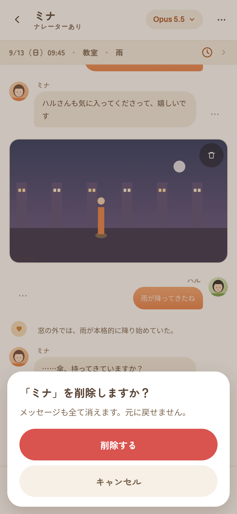

- 取り消せない操作の前に出す。呼ぶ側は `ask({ title, body, okLabel, cancelLabel, danger })`（`store.ts`）。結果は「実行してよいか」の真偽。
- 暗幕の上、**画面下に寄せた白いカード**（角丸24・左右12px・最大幅420）。題（18px太字）→ 本文（13.5px `--muted-strong`、改行を保つ）→ **縦に並ぶ全幅ボタン2つ**（高さ52。上が実行・下がキャンセル）。
- `danger` のときは実行ボタンを `--danger` の地に白文字。そうでなければ主ボタン（`--accent`）。
- `role="alertdialog"`。**開いたら「キャンセル」にフォーカス**（Enter の押し間違いで実行しない）。**Esc と暗幕のタップはキャンセル。**
- モーダルの中（ロアの編集など）から開いても上に出る（z-index 150）。

### 4.5 トースト

画面下の中央（下 88px + セーフエリア、幅は 92vw か 460px の小さい方）に積む。入力欄・固定バー・下部タブに重ならない高さ。地は `--text` の濃い茶、文字は白系、角丸 16。`.warn` は赤地。**4.2秒で消え、タップでも消える。** 下から8px で現れる。

### 4.6 その他

- **empty-note**: 中央寄せの `--muted` の説明文（13px・行間 1.7）。空の状態・補足説明・エラー（`.err` は赤の左寄せ）に広く使う。モーダル内の補足は `style` で左寄せ・余白なしに上書きして使っている（インライン `style` は全体で61箇所）。
- **warn-list**: 淡い面の囲み（角丸16）。見出し（`<b>` オレンジ）＋指摘を縦に並べる。暦の「確認したい点」・メモリー整理の警告・接続先のモデル一覧失敗・文脈の予算の不足で使う。
- **設定の補足**: 短い説明文（`.set-note`、12.5px `--muted-strong`）／淡い面の囲み（`.set-box`、計算結果など）／折りたたみ（`.set-more`、「くわしく」など）。
- **pre-block**: 淡い面のコード風ブロック（最大高 320 でスクロール）。
- **stat（統計カード）**: 2×2 のグリッド。数字（英字体 20px・オレンジ）の下に説明。
- **planrow**: 整理案の1件。タグ（操作・対象）→ 見出し → 本文。左に 3px の色線。
- **mem-cand**: メモリー候補の1件。タグ → 本文 → 理由（淡い）。
- **memrow**: メモリーの1行。ピン・本文（3行まで）・出どころのタグ・日付・›。
- **scene-break**: 左右の線の間に場面名と取り消しボタン。
- **アバター（Avatar）**: 画像（URL・data URL）ならそれを丸く、無ければ絵文字・文字、それも無ければ頭文字、さらに無ければ人型アイコン。脇役（その場限り）は頭文字の代わりに人型アイコン。

---

## 5. 画面別仕様

各画面は「目的 → 構成 → 操作 → 状態 → 見せ方・挙動」の順です。ラベルは画面に出る文言そのままです。

### 5.1 ログイン　`認証が必要なときだけ`

 

- 目的: `APP_PASSWORD` を設定しているときの入口。**未認証のとき、他の画面は一切出ない。**
- 構成: 中央に幅 360 の縦並び — アプリ名（`h1`・22px、`/api/config` の `appTitle`）／パスワード欄（プレースホルダ「パスワード」、自動フォーカス）／主ボタン「ログイン」。
- 状態: 入力が空か送信中は「ログイン」が無効。失敗するとトースト（赤）でサーバのメッセージを出す（`login-02`）。
- 認証の要否は起動時に判定する。判定中は「読み込み中…」だけが出る。

### 5.2 チャット（下部タブの1つ目）　`/chats`・`/chats/archive`

  

- 目的: 会話の一覧と、新しい会話の開始。
- 構成: 大見出し「チャット」（右のアイコンは無い）／会話の行／末尾の「アーカイブ N件 ›」／右下の FAB（＋、`aria-label` は「新しい会話」。下部タブの上に浮く）／下部タブ。
- 会話の行: 丸いアバター（先頭の参加キャラ。画像・絵文字・頭文字。無いときは淡いオレンジ地）／名前（付けた会話名が最優先、無ければキャラ名）／右に更新日時（今日 → `14:13`、昨日 → `昨日`、今年 → `9/28`、それ以前 → `2025/9/28`）／**名前の下に `世界名 ・ シナリオ名`**（11.5px太字・`--accent-ink`・1行。シナリオが消されていれば世界名だけ）／説明（直近のやり取りの抜粋、2行まで）。行全体をタップで会話へ。**行に削除などの操作は無い。**
- **アーカイブ**: 一覧の最後に「アーカイブ　N件 ›」の行（地 `#fbf7f1`・角丸16。0件なら出さない）。押すと `/chats/archive`（題「アーカイブ」・戻るあり・タブと FAB は出さない）。
- 空の状態: 「まだ会話がありません。右下の＋から始めましょう」／アーカイブでは「アーカイブした会話はありません」。
- **新規モーダル「シナリオを選ぶ」**: 世界ごとの見出し（小さい英字体）の下にシナリオの行（題・説明・›）。**タップした時点で会話が作られ**、そのまま会話画面へ移る（確認なし）。シナリオが1つも無いときは「シナリオがありません。世界を開いてシナリオを作成してください」と主ボタン「世界へ」。

### 5.3 世界の一覧　`/worlds`


- 大見出し「世界」（右: 取り込み＝アップロードアイコン、`aria-label`「世界を取り込む」。JSON を選ぶと世界を作る。完了トースト「『○○』を取り込みました（キャラN / ロアN / 場所N）」）。下部タブあり。
- 行: 地球のアイコン（淡いオレンジの丸）・名前・説明・›。末尾に「世界を追加」行。
- 「世界を追加」は**ブラウザ標準の入力ダイアログ**（`prompt`「新しい世界の名前は？」）で名前を聞き、作成後に世界の詳細へ移る。
- 空: 「世界がまだありません」。

### 5.4 会話　`/chats/:id`（アプリの中心画面）

 

**領域（上から）**

1. **トップバー**: 戻る（`/chats` へ）／会話名（太字）と「ナレーターあり」か「ナレーターなし」／右にモデルピルと **⋯（この会話のメニュー、2.4）**。
2. **ステートバー**（`--surface-2` の帯・高さ 36）: `9/13（日）09:35 ・ 教室 ・ 晴` の形（区切りの `・` は `--chevron`）。右端に、大きく時間が飛んだときの `+NNH` タグ（直前の応答から 24時間を超えるとき）、時計アイコン（場面を進める。20px・`--accent-ink`・当たり判定 44×44）、›。**バー全体をタップするとステート編集へ**（› はその目印）。時計だけは「場面を進める」モーダル。
3. **メッセージ領域**（スクロール）: 先頭に、古い分が残っているとき「さかのぼる（残り○件）」（小さいピル。押すと40件ずつ足す）。以降は発話を時系列に並べる（下記）。
4. **一時指示バー**（設定中のみ）: 入力欄の真上に1行のチップ（✦・「今回だけ」か「手動で消すまで」・指示文を ` / ` でつないだ1行）と ×。
5. **入力欄**: ＋／複数行の入力（最大160px まで伸びる。プレースホルダ「メッセージを入力…」。⌘/Ctrl + Enter で送信）／送信（丸・オレンジ。空のとき無効）。生成中は送信が赤い停止（■）に変わる。
6. **＋シート「物語を進める」**（開いたときのみ。暗幕の上に**重ねる**ので、会話領域は縮まない → `chat-06`。2.3）。

**発話の種類と見え方**

| 種類 | 見え方 |
|---|---|
| キャラ | 左に丸アバター（淡いオレンジ地）。上に名前、下に吹き出し（`--char-bubble`、左下だけ小さい角）。右に操作列 |
| ユーザー（ペルソナ） | 右にアバター。吹き出しは**オレンジのグラデーション**で、右下だけ小さい角。操作列は**左側**。左に 20px の字下げ |
| 脇役（その場限りの `NPC[名前]:`） | キャラと同じ配置。アバターは人型アイコン |
| ナレーション | 吹き出しにせず、左にハートの丸（26px）＋ `--narration` の文字。操作列は右 |
| 場面転換 | 左右の線の間に場面名＋ゴミ箱（「この場面転換を取り消す」）。操作列なし |
| スナップショット | 発話の下に横いっぱいの画像。右上に半透明の丸いゴミ箱。タップで原寸（5.4-⑦） |

1メッセージに複数の話者がいると、話者ごとに別の行（吹き出し）になり、操作列は**最後の行にだけ**付く。吹き出し内は「」の部分がセリフ、それ以外が地の文（淡く小さい）。

**操作要素**

| 操作 | 場所 |
|---|---|
| 送信 / 停止 | 入力欄の右 |
| 応答を再試行 | 最後がユーザー発言で生成中でないとき、メッセージ領域の末尾中央（`pill sm`、更新アイコン付き） |
| 候補の切替・再生成 | 最後のAI応答の脇「‹ 1/3 ›」 |
| ⋯メニュー | 各メッセージの脇（2.5） |
| ＋メニュー（物語を進める） | 入力欄の左（2.3） |
| この会話のメニュー | 右上の ⋯（2.4） |
| モデル切替 | 右上のピル（2.6） |
| 下書き | 入力途中の文は会話ごとにブラウザへ保存され、戻ると復元される |

**モーダル**（すべて暗幕タップで閉じる）

| モーダル | 画像 | 内容 |
|---|---|---|
| 場面を進める |  | 説明文／「クイック」`+30分` `+1時間` `+3時間` `翌朝 8:00` `翌日の同じ時刻`／「日時を指定」年・月・日・時・分の数値5つ／「場所（変えるときだけ選ぶ）」セレクト（既定 `（変えない）`）／主ボタン「この日時へ進める」。完了はトースト「M月D日 HH:mm へ進めました ／ 天気は「○○」 ／ イベント: ○○」 |
| 一時指示 |  | 複数行入力（プレースホルダ3行の例）／「有効範囲」チップ `今回だけ`・`手動で消すまで`（下に動作の説明が切り替わる）。操作: 「消す」（設定済みのときだけ）・「保存」 |
| プロンプトの確認 |  | モデル・トークン数 `N / M TOK`・削られた分のタグ／「末尾（毎ターン変わる部分）」「進行状況」「イベント判定」「ロア 発火N / 採用N / 予算超過N」「前置き（キャッシュする部分）」の各ブロック。操作: 「閉じる」 |
| メモリー候補 |  | 対象範囲の説明／候補のカード（キャラ名・対象・日付のタグ → 本文 → 理由）。操作: 「N件を保存」（候補があるときのみ） |
| 会話の名前 |  | 名前欄（プレースホルダは先頭キャラ名）・補足「空にすると、参加しているキャラクターの名前で表示されます」。操作: 「保存」 |
| この会話の設定 |  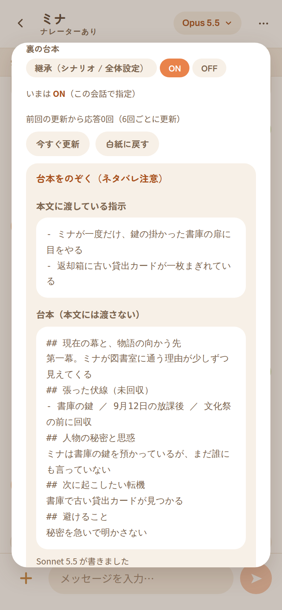 | 「参加キャラ（タップで加除）」チップ／「条件付きイベント」「進行フラグ」「裏の台本」の3値トグル＋「いまは ON（シナリオの設定）」の解決結果／説明文。**保存ボタンは無く、押した時点で反映**。「裏の台本」の下に状態の1行（`前回の更新から応答N回（6回ごとに更新）`・まだ無ければ `まだ台本はありません。応答2回で最初の台本を作ります`）・「今すぐ更新」「白紙に戻す」（台本があるときだけ。確認ダイアログ）・OFFで台本があるときは「OFFの間は、台本があっても本文には渡しません」・**中身は折りたたみ「台本をのぞく（ネタバレ注意）」に隠す**（開くと「本文に渡している指示」と「台本（本文には渡さない）」と書いたモデル） |
| メッセージを編集 |  | 「本文のみ修正します。ステートは変わりません」／大きなテキストエリア。操作: 「保存」 |
| この場面を描く |  | 「プロンプト（送る前に直せます）」（中身に合わせて伸びる、画面高の45%まで）／「比率」「品質」セレクト（品質は `低（安い・速い）`・`中`・`高（高い・遅い）`）／トグル「参照画像を使う」「自分（ペルソナ）も描く」／「モデル: … ／ 生成すると課金されます」。操作: 「生成する」（生成中は「生成中…」） |
| スナップショット（原寸） |  | 原寸の画像だけ。操作は「キャンセル」のみ |

**そのほかの状態の画像**

| 状態 | 画像 |
|---|---|
| 一番上までさかのぼった |  |
| 場面転換の区切り線 |  |
| スナップショットが発話の下に並ぶ |  |
| メッセージの⋯メニュー |  |
| ＋メニュー（物語を進める） |  |
| 右上の ⋯（この会話のメニュー） | 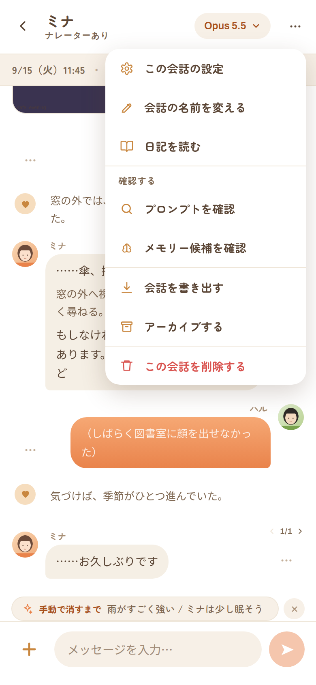 |
| 確認ダイアログ（会話の削除） |  |
| モデルのメニュー |  |
| 一時指示のチップ |  |
| 生成中（ストリーミング） |  |
| 失敗して「応答を再試行」が出ている |  |
| 3日以上のジャンプで `+NH` タグ |  |

**生成中の見え方**（`chat-18`）:

- **送った発言は、送信した瞬間に**自分の吹き出しとして末尾に出る（保存された発言が読み直されるまでの仮の表示。再試行・再生成・オートプレイでは出さない）。
- 流れてくる本文は、**完成時と同じ規則で話者ごとに分けて**、完成時と同じ部品（アバター・名前・セリフと地の文の色分け）で描く。最後の吹き出し（またはナレーション）の末尾に点滅するキャレット（幅2×高16、オレンジ）。
- 書きかけの行が話者ラベルの途中かもしれないとき（「ミナ」まで届いて「:」がまだ）は、その行だけ待ってから出す（地の文として一瞬出てから吹き出しに変わる、というちらつきを防ぐ）。
- 1行目の話者がまだ分からない間は、キャレットだけを出す。
- 生成中の吹き出しには ⋯ や候補の切替を出さない。入力欄の送信は停止ボタンになる。完了すると、保存された内容に置き換わる。

### 5.5 ステート編集　`/chats/:id/state`

  

- トップバー「ステート編集」、副題は `季節 第N週 曜`。戻り先は会話。
- セクション（小見出しは英字体のものと日本語のものが混在）:
  - `Game Time`: 年・月・日・時・分（幅84の数値入力が横に並ぶ）
  - `Place & Weather`: 「場所」セレクト（既定 `（未設定）`）／「場所メモ（未登録地。空にすると登録場所を優先）」／「天候」
  - `Present`: 在席キャラのチップ（タップで入退席）
  - 「進行状況」（有効なときだけ）: 変数ごとに設定行（数値=ステッパー、真偽=トグル、文字列=入力）。フェーズ変数は現在の段階の名前と公開状態を補足に出す
  - 「イベント発火履歴」（有効なときだけ）: 行ごとにイベント名・日時、右に赤いゴミ箱（確認ダイアログ「この発火を取り消しますか？」）
  - `State Delta ログ`: 直近12件のAI応答の冒頭60字。タップで差分とその時点の状態を `pre` で展開
- 固定バー: 主ボタン「保存」のみ。保存するとトースト「ステートを保存しました」。

### 5.6 あらすじ　`/chats/:id/summary`

 

- トップバー「あらすじ」、右に更新アイコン（`title`「今すぐ要約」）。
- 大きなテキストエリア（最小高 46dvh）。空のプレースホルダは「まだあらすじがありません。会話が進むと自動で要約されます」。下に「最終更新: 2026/10/01 14:13」の形の日時。
- 固定バーの「削除」は確認ダイアログ（「あらすじを全て削除しますか？」）のあと削除。
- 固定バー: 「削除」（赤）と 主ボタン「保存」（要約中は「要約中…」）。

### 5.7 アルバム　`/album`

    

- **世界の一覧**: 大見出し「アルバム」＋その下に「N枚 ・ XX MB」。下部タブあり。行は カメラのアイコン・世界名・「N枚 ・ XX MB」。空は「まだスナップショットがありません。会話でAIの応答の「⋯」から「この場面を描く」で作れます」。
- **世界のグリッド**（同じURLのまま切替。戻るで一覧へ。タブは出さない）: トップバーの副題に枚数と容量。右上のチェックアイコンで**選択モード**（アイコンが × に変わる）。
  - サムネイル未作成があるとき、上に淡い帯「サムネイル未作成がN枚あります。…」と「サムネイルを作る」。
  - 会話ごとに見出し（会話名・枚数・容量）＋3列の正方形グリッド（隙間 6）。各会話の下に「会話を開く」（選択モード中は非表示）。
  - 選択モード: セルに丸いマーク、選択中はオレンジの太枠＋薄いオレンジの面。下端に固定の帯「N枚 ・ XX MB」と「選んだ画像を削除」。押すと確認モーダル「N枚を削除しますか？」（本文「XX MBぶん空きます。会話画面からも消えます。元に戻せません」。操作は「削除」）。
  - 通常時にセルをタップすると原寸のモーダル（題は会話名、本文に `2026/10/01 14:13` の形の日時・容量・モデル・プロンプト、操作は「削除」）。

### 5.8 世界の詳細　`/worlds/:id`

   

**1つの画面に、遷移の入口・一覧・編集フォームが縦に並ぶ。**

- トップバー: 世界名、右に書き出し（ダウンロード）。
- 入口の行（淡いオレンジの丸アイコン付き）: `ロアブック`（件数）／`場所`（件数）／`暦・天候`／`イベント`（件数）／`メモリーの整理`（「書き出してAIにまとめさせる」）。
- `Characters`: 見出しの右に「V2取込」。キャラの行（アバター・名前・「準レギュラー」タグ・別名か性格の抜粋）。「キャラクターを追加」行（`prompt`「キャラクター名は？」）。
- `Scenarios`: シナリオの行（右に 再生＝「この設定で開始」と ゴミ箱＝「削除」）。タップで**シナリオ編集モーダル**。「シナリオを追加」行（即座に「新しいシナリオ」を作って編集を開く）。
- `World`: 「名前」「説明」「世界のシステムプロンプト（文体・世界観・許可される表現）」「ナレーターの指示」「進行フラグの定義（JSON配列。…）」（等幅・大）。
- 固定バー: 「削除」（赤）と 主ボタン「保存」。**この保存は `World` の欄だけ**を保存する（キャラ・シナリオはそれぞれ別に保存される）。削除は確認ダイアログの本文に、消える件数（キャラ／シナリオ／チャット／ロア／場所／イベント／スナップショット／参照画像）が並ぶ。
- **シナリオ編集モーダル**: タイトル／状況設定／参加キャラ（チップ）／既定ペルソナ／冒頭の応答文（話者ラベル付き）／「初期ステート」開始時刻（年月日時分）・暦の説明「この世界の暦: 1年 = N か月 / 1か月 = N日」・場所・天候・開始時の在席キャラ／トグル「ナレーター」／3値「条件付きイベント」「進行フラグ」「裏の台本」。操作: 「保存」。

### 5.9 キャラクター編集　`/characters/:id`

 

- トップバー「キャラクター編集」、右に 脳（メモリー、`title`「メモリー（N）」）とダウンロード（`title`「V2書き出し」）。
- フォーム: アイコン枠（60px・カメラバッジ）と名前／「アイコン（絵文字・画像URL。…）」／「別名（読点・カンマ区切り。…）」／「ペルソナ（性格・背景）」／「外見（画像生成用）」／「参照画像（スナップショット用。切り抜かずに渡します）」／「話し方・口調」／「口調例（…）」／「キャラクターID（…タップでコピー）」／トグル「準レギュラー」。
- 固定バー: 「削除」（確認ダイアログ「『○○』を削除しますか？」・本文「メモリーも削除されます。」）と主ボタン「保存」。

### 5.10 メモリー　`/characters/:id/memories`

 

- トップバー「メモリー」、副題「キャラ名・N件（うちOFF N）」。
- 一覧は `ピン留め` → `そのほか`（ピン留めが無いときは見出し無し）→ `注入しない`（淡い字）の順。各行: 左にピン（押すとピン留め切替）／本文（3行まで）／タグ `自動抽出` か `手動`・`OFF`・対象キャラ名・日付／›。
- 固定バー: **テキストエリア（最小高 92）＋ ＋ボタン**で追加。追加ボタンは `aria-label`「追加」で、見た目の装飾が無い（7章 A-3）。
- 編集モーダル「メモリーを編集」: 内容／「対象（指定するとその人物が在席のときだけ注入）」（既定 `（常時）`）／「日付（…）」年・月・日（と「日付なしにする」）／トグル「注入する」「ピン留め」。操作: 「削除」（確認ダイアログ）・「保存」。

### 5.11 メモリーの整理　`/worlds/:id/memory-review`

  

- トップバー「メモリーの整理」、副題に世界名、右に書き出し（ダウンロード）。
- `いまの状態`: 統計カード4枚（記憶の総数／注入オン／注入オフ／注入される文字数）。対象タグが解決できない記憶があれば `warn-list`、続けて説明文。
- `整理案`: 右上「ファイル」。説明／「整理案のJSON」（等幅・大）／ボタン2つ「確認する」「適用する」（適用は確認後だけ有効）。確認前に入力があるときは「先に『確認する』で中身を見てください。」
- 結果: 見出し「この整理案で起きること」（適用後は「適用しました」）／警告（あれば）／タグ `記憶 6 → 4`・`文字数 83 → 78`／整理案の行（左の色線: 削除=赤・注入オフ=灰・追加=オレンジ。タグ=操作ラベル（`注入オフ` `注入オン` `削除` `書き換え` `追加`）・対象）。変更が無ければ「変更はありません」。

### 5.12 ロアブック　`/worlds/:id/lorebook`

  

- トップバー「ロアブック」、右に取り込み・書き出し。
- 「検索」欄／カテゴリのチップ `すべて N` `世界観 N` `用語 N` `人物 N` `場所 N` `イベント N` `その他 N`／有効のチップ `ON / OFF 両方` `ON N` `OFF N`（カテゴリと掛け合わせ）。
- 行: 題・`常時`/`OFF` タグ／説明（キーワード先頭3つ＋「+N」・場所数・季節・カテゴリ・優先度）。末尾「エントリを追加」（即座に「新しいエントリ」を作って編集を開く）。
- 編集モーダル「ロアエントリ」: タイトル・カテゴリ／「発火キーワード（N語）」チップ入力／「注入本文」／「優先度（大きいほど優先）」「対象キャラ（…）」／「場所トリガー（現在地が一致で発火）」チップ／「季節トリガー」チップ（暦に無いものは `（暦に無し）`・点線）／トグル「常時注入」「有効」。操作: 「削除」（確認ダイアログ）・「保存」。

### 5.13 場所　`/worlds/:id/locations`

  

- トップバー「場所」、右に鉛筆（`title`「エリアを編集」）。
- 行: ピンのアイコン・名前・`屋内` タグ・説明（ID・エリア名・開店–閉店・補足）。末尾「場所を追加」。
- 編集モーダル「場所を追加／場所を編集」: 「ID（英小文字・数字・_）」（作成後は変更不可）／「表示名」／「エリア」／「補足」／「開店」「閉店（翌日なら 26:00 のように24超）」（時刻の入力欄。下に解釈結果「HH:MM として保存します」／「空欄なら終日」／赤で「時刻として読み取れません（例: 16:00）」）／トグル「屋内」（「天候行を状況ブロックに入れない」）。操作: 「削除」（新規以外）・「保存」。
- **エリアのモーダル**: 行ごとに 表示名の入力・ID（`code`）・上へ・下へ・削除（使用中は無効）。下に「エリアを追加（IDは後から変えられません）」と「追加」。操作: 「保存」。

### 5.14 暦・天候　`/worlds/:id/calendar`

  

- トップバー「暦・天候」。固定バー: 主ボタン「保存」。
- 上に（あれば）`warn-list`「**確認したい点**」＋指摘。保存は通る。トースト「暦を保存しました（確認したい点がN件）」。
- セクション: `Calendar`（「1年の月数」「1ヶ月の日数」ステッパー・「曜日名（区切り）」）／`Last Train`（トグル「終電の行を出す」・呼び方・時刻・通知・後の文）／`Seasons`・`Sunrise / Sunset`・`Weather`（JSON を等幅のテキストエリアで直接編集）／「1日の区切り時刻（天候の引き直し・日記）」ステッパー（0時からの分。既定240＝朝4時。天候と日記の1日はこの時刻で切り替わる）。
- JSON が壊れていると保存時にトースト「保存できません: …」（赤）。

### 5.15 イベント　`/worlds/:id/events`

   

- トップバー「イベント」、右にコンパス（`title`「最新のチャットで評価」）。評価は結果のモーダル「最新のチャットで評価」（行ごとに題と結果タグ。`採用`だけオレンジ）。
- 行: 題・種別タグ（`雰囲気`/`物語`/`必須`）・確率・`演出指示`・`OFF`／説明2行（条件・判定タイミング・再発制御・優先度・注入文の抜粋）。末尾「イベントを追加」。
- フェーズ変数の遷移イベントが足りないとき、上に説明の囲み（7章 A-2: この囲みには見た目の指定が無い）。
- 編集モーダル「イベント」: 題・種別・注入モード・注入する一文・「条件（JSON。…）」・判定タイミング・再発制御（選んだ値で追加欄が出る）・発生確率・優先度・「発火時に進める進行フラグ（JSON配列。…）」・トグル「有効」。操作: 「削除」（確認ダイアログ）・「保存」。

### 5.16 ペルソナ　`/personas`

 

- 一覧（大見出し「ペルソナ」・下部タブあり）: 行（アバター・名前・`DEFAULT` タグ・説明）／「ペルソナを追加」（即座に「新しいペルソナ」を作って編集へ）／空「あなたの分身となるペルソナを作成してください」。
- 編集（**同じURLで切り替わる**。トップバー「ペルソナ編集」。タブは出さない）: アイコン枠と名前／アイコン／「説明（プロンプトに入ります）」／「外見（画像生成用）」／「参照画像（…）」／トグル「既定のペルソナ」。固定バー: 「削除」と「保存」。
- 変更したまま戻ると確認ダイアログ（題「保存していない変更があります」・本文「破棄して戻りますか？」・「破棄する」（赤）／「編集を続ける」）。**この確認があるのはここだけ**。

### 5.17 設定（下部タブの5つ目）　`/settings` とサブページ

 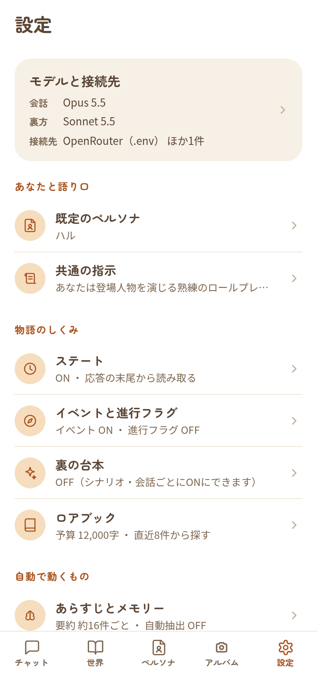

**ハブ（`/settings`）**: 大見出し「設定」・下部タブあり。**行は「開く」だけで、トグルや数値は置かない。** 各行の下に今の値を1行で出す。末尾に「✓ 変更はその場で保存されます」。

| 区分（小見出し） | 行 | 今の値の出し方 |
|---|---|---|
| （先頭のカード、地 `--surface-2`・角丸20） | モデルと接続先 | 3行: `会話 Opus 5.5`／`裏方 Sonnet 5.5`／`接続先 OpenRouter（.env） ほか1件` |
| あなたと語り口 | 既定のペルソナ | 指定したペルソナ名。空なら `ペルソナ側の既定（ハル）` |
| | 共通の指示 | 1行目（省略） |
| 物語のしくみ | ステート | `OFF` か `ON ・ 応答の末尾から読み取る`／`ON ・ 別の呼び出しで読み取る` |
| | イベントと進行フラグ | `イベント ON ・ 進行フラグ OFF` |
| | 裏の台本 | `OFF（シナリオ・会話ごとにONにできます）` か `ON ・ 応答6回ごとに更新` |
| | ロアブック | `予算 12,000字 ・ 直近8件から探す` |
| 自動で動くもの | あらすじとメモリー | `要約 約16件ごと ・ 自動抽出 OFF`（自動要約OFFなら `要約 OFF`） |
| | オートプレイ | `最大3ターン ・ 区切りで止める`（判断OFFなら後半を省く） |
| | スナップショット | `OFF ・ 画像モデル未設定` か `ON ・ {画像モデル}` |
| 詳細 | 文脈の予算 | `履歴48件 ・ 安全余白1,024トークン` |

**サブページ**（トップバー・戻るはハブへ。要約の方針だけ「あらすじとメモリー」へ。タブは出さない）。数値はステッパーで、単位は項目名のうしろに小さく出す。

| ページ | 画像 | 中身 |
|---|---|---|
| モデルと接続先 | 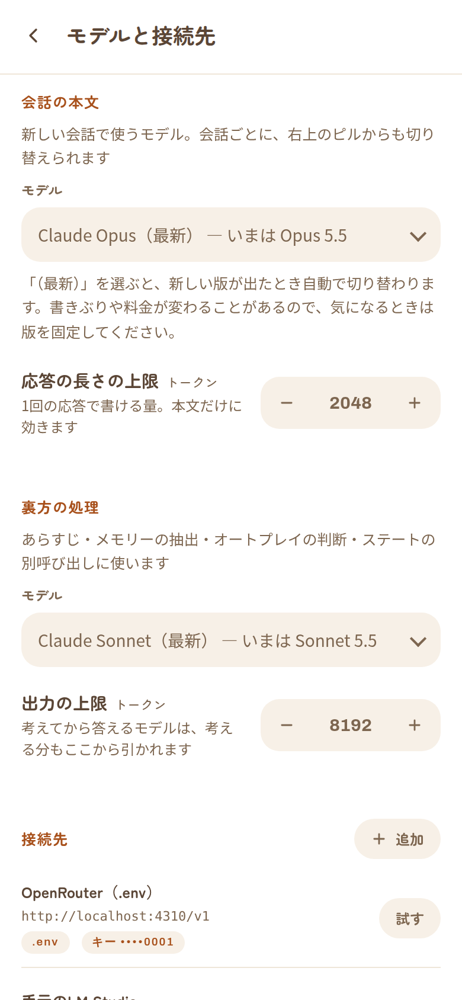  | 小見出し「会話の本文」（「新しい会話で使うモデル。会話ごとに、右上のピルからも切り替えられます」）: モデル（セレクト。接続先ごとのグループ）・「応答の長さの上限 トークン」／「裏方の処理」（「あらすじ・メモリーの抽出・オートプレイの判断・ステートの別呼び出しに使います」）: モデル・「出力の上限 トークン」／「接続先」（右に「＋ 追加」）: 行（太字の名前・URL（等幅）・タグ `.env`／`キー ○○○○`（末尾4文字）か `キー未設定`／`コンテキスト N`／`使用中`）、右に「試す」と鉛筆（組み込みには鉛筆無し）。末尾「APIキーはこのサーバのデータベースに保存され、画面には末尾4文字だけ出ます。」。接続先エディタ（モーダル「接続先を追加」／「接続先」）: 「名前」「ベースURL」「APIキー」（既存があれば「空のままなら変更しません」）「コンテキスト長（0 なら「文脈の予算」の想定コンテキスト長を使う）」 |
| 既定のペルソナ | 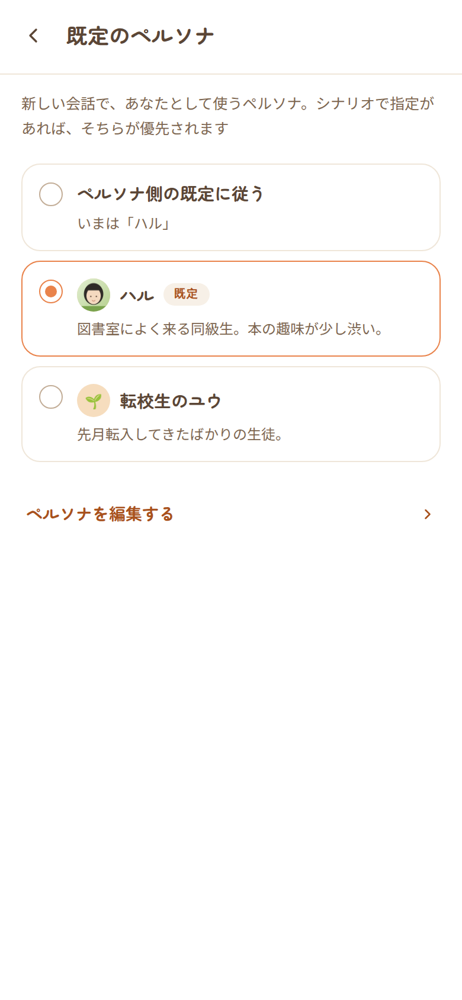 | 択一カードの一覧。先頭「ペルソナ側の既定に従う」（説明に `いまは「ハル」`）、続いて各ペルソナ（アバター・名前・「既定」タグ・説明2行）。下に「ペルソナを編集する ›」 |
| 共通の指示 | 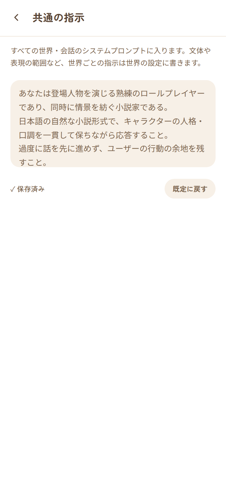 | 説明「すべての世界・会話のシステムプロンプトに入ります。…」／画面いっぱいのテキストエリア／「✓ 保存済み」か「入力欄から離れると保存されます」／「既定に戻す」（確認ダイアログ） |
| ステート | 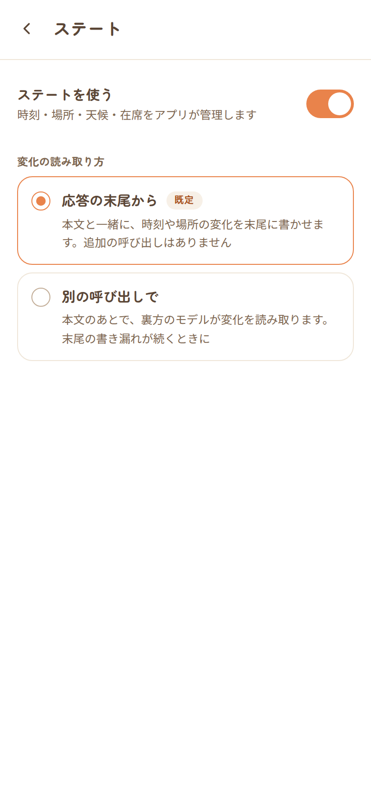 | トグル「ステートを使う」。ONのときだけ「変化の読み取り方」の択一カード2枚（「応答の末尾から」＋「既定」タグ／「別の呼び出しで」）。OFFのときは注記「OFFのあいだは、…『場面を進める』は使えます。」 |
| イベントと進行フラグ | 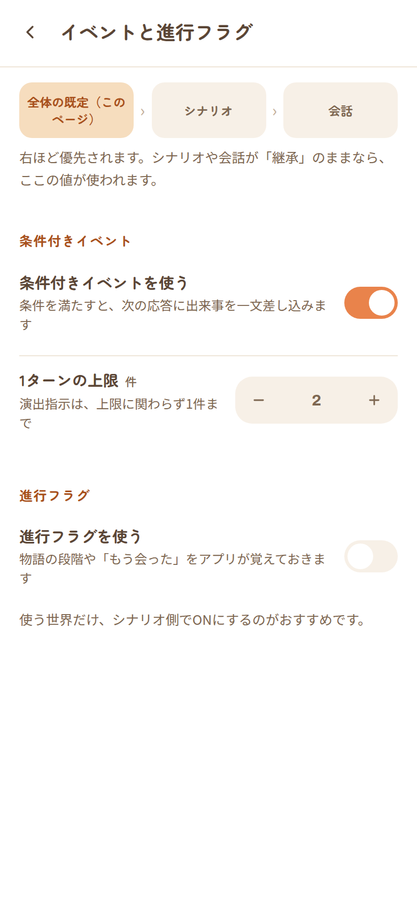 | 先頭に「全体の既定（このページ） › シナリオ › 会話」の3つの箱と「右ほど優先されます。…」／「条件付きイベント」: トグル・「1ターンの上限 件」（全体OFFでも出す）／「進行フラグ」: トグル・「使う世界だけ、シナリオ側でONにするのがおすすめです。」 |
| 裏の台本 | 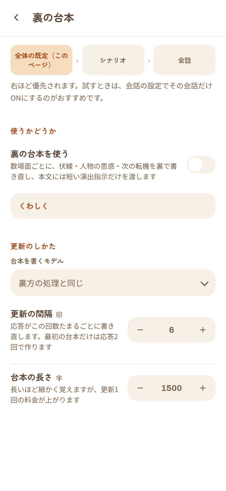 | 先頭に「全体の既定（このページ） › シナリオ › 会話」の3つの箱と「右ほど優先されます。試すときは、会話の設定でその会話だけONにするのがおすすめです。」／「使うかどうか」: トグル「裏の台本を使う」・折りたたみ「くわしく」（台本そのものは本文のモデルに渡さないこと、OFFなら呼び出しも注入もしないこと）／「更新のしかた」: 「台本を書くモデル」（空は「裏方の処理と同じ」）・「更新の間隔 回」（1〜30）・「台本の長さ 字」（500〜5000、250刻み）。**既定はOFF** |
| ロアブック | 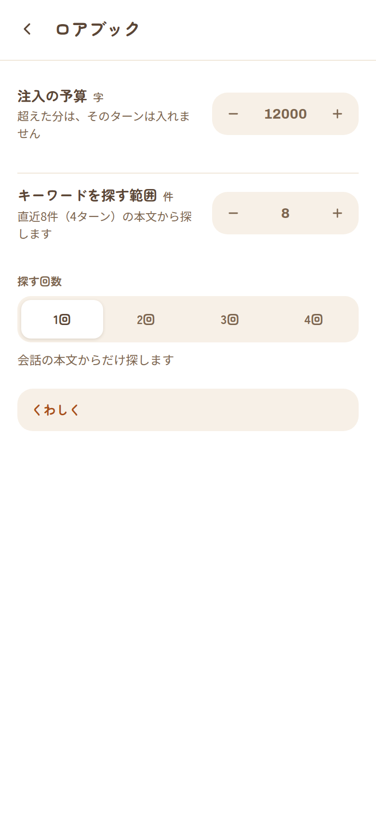 | 「注入の予算 字」・「キーワードを探す範囲 件」（説明に `直近8件（4ターン）の本文から探します`）・「探す回数」（切り替え 1回〜4回、選択に応じた説明）／折りたたみ「くわしく」 |
| あらすじとメモリー | 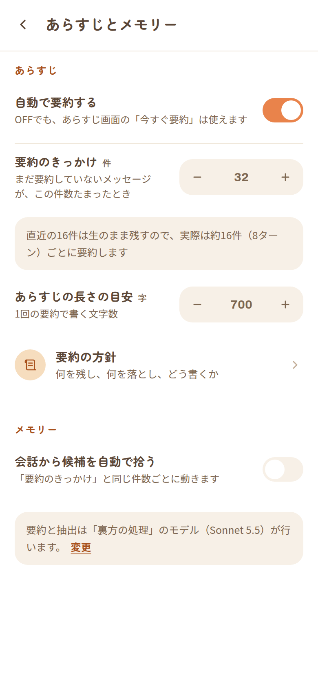 | 「あらすじ」: トグル「自動で要約する」・「要約のきっかけ 件」・（自動要約ONのときだけ）計算結果の囲み `直近の16件は生のまま残すので、実際は約16件（8ターン）ごとに要約します`・「あらすじの長さの目安 字」・「要約の方針 ›」／「メモリー」: トグル「会話から候補を自動で拾う」／末尾の囲み「要約と抽出は『裏方の処理』のモデル（Sonnet 5.5）が行います。 変更」。**自動要約がOFFでも、きっかけ・目安・方針は隠さない** |
| 要約の方針 | 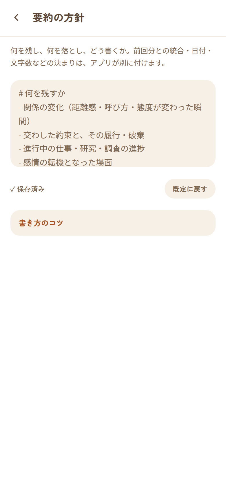 | 共通の指示と同じ形。説明「何を残し、何を落とし、どう書くか。…」／折りたたみ「書き方のコツ」 |
| オートプレイ | 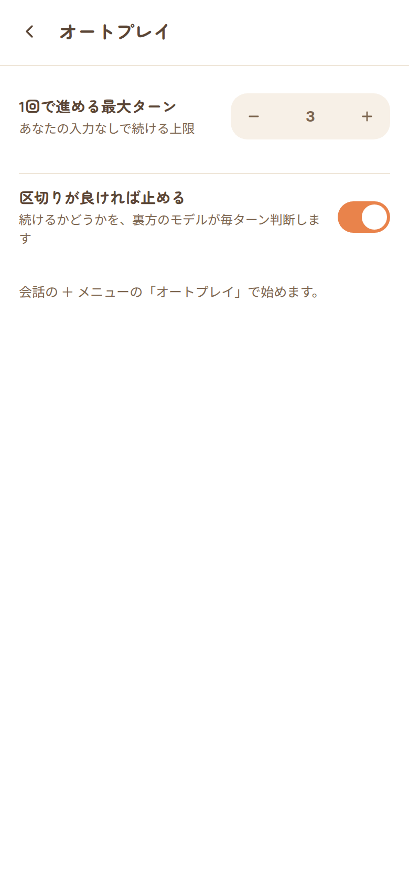 | 「1回で進める最大ターン」（字下げしない）・トグル「区切りが良ければ止める」／「会話の ＋ メニューの『オートプレイ』で始めます。」 |
| スナップショット | 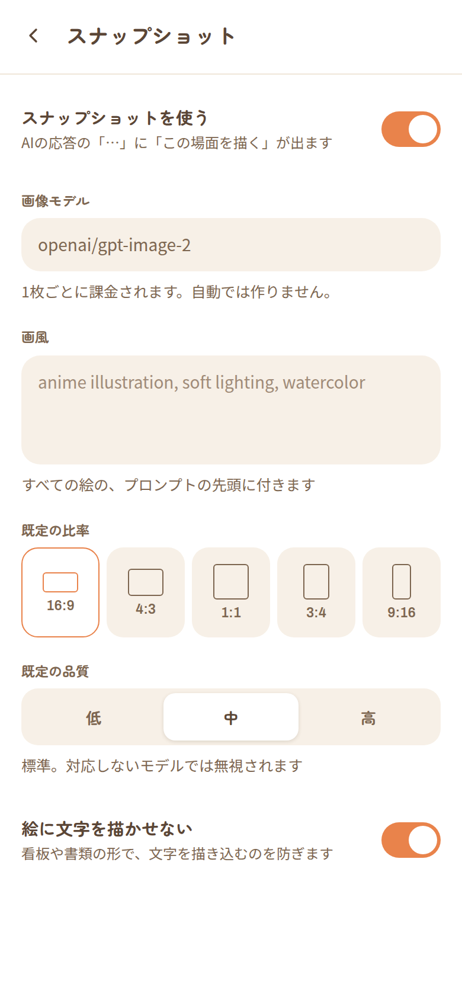 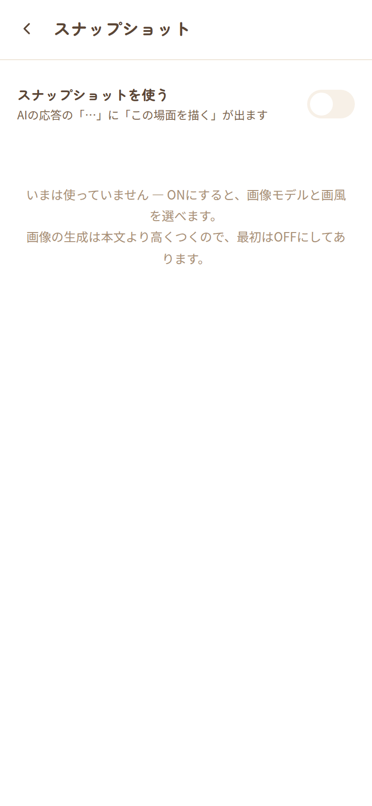 | トグル「スナップショットを使う」。ONのとき: 「画像モデル」（候補つきの入力）・「画風」・「既定の比率」（5つのボタン。縦横比どおりの小さな枠つき）・「既定の品質」（切り替え 低・中・高と説明）・トグル「絵に文字を描かせない」。OFFのとき: 「いまは使っていません — …」。OFFにすると今の画像モデルを覚え、ONに戻すと入れ直す（覚えた値が無ければ欄にフォーカスし「画像モデルを入れると使えるようになります」） |
| 文脈の予算 | 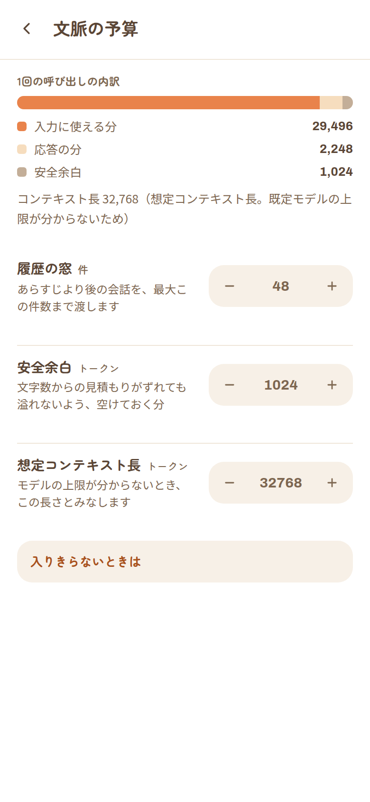 | 「1回の呼び出しの内訳」の横棒（入力に使える分・応答の分・安全余白）と数値、コンテキスト長とその出どころ／「履歴の窓 件」・「安全余白 トークン」・「想定コンテキスト長 トークン」／折りたたみ「入りきらないときは」 |

- **保存**: ボタンは無く、**変えた時点で保存**する。「共通の指示」「要約の方針」（長文）だけは、入力欄から離れたとき・画面を離れたとき・アプリを切り替えたとき（`visibilitychange`）に保存する。

---


### 5.18 日記　`/chats/:id/diary`

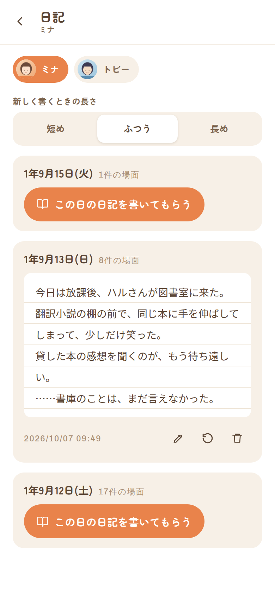 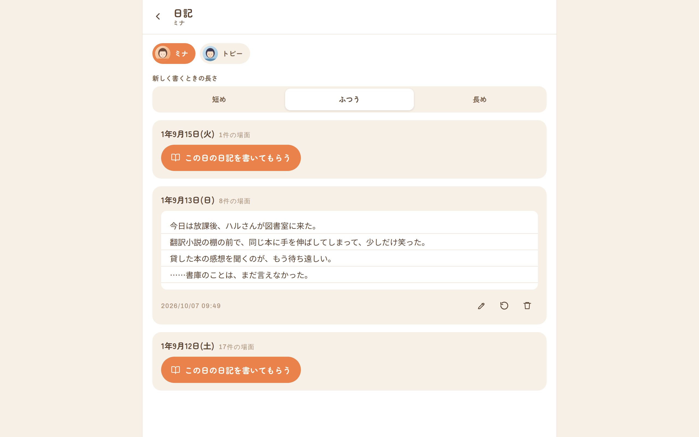

- 入口は会話の右上 ⋯「日記を読む」。トップバー「日記」（下に選んでいるキャラ名）・戻るは会話へ。タブは出さない。
- 上から: 人の切り替え（丸いピル。アバター＋名前、選択中は `--accent` 地・白字。横にスクロール）／「新しく書くときの長さ」切り替え `短め`・`ふつう`・`長め`／日のカード（新しい日が上）。
- 日のカード（地 `--surface-2`・角丸）: 見出し `1年9月15日(火)` と小さく `N件の場面`。**そのキャラが居合わせた日だけ**並ぶ。
  - 未作成: 主ボタン「この日の日記を書いてもらう」（書いている間は「（名前）が書いています…」、他の日のボタンも押せない）。
  - 作成済み: 罫線入りの紙面（行送り30px、白地）に本文／書いた日時（`formatDateTime`）／鉛筆（編集モーダル）・再読込（書き直し。確認ダイアログ）・ごみ箱（削除。確認ダイアログ）。
- 編集モーダル: 題 `（日付） の日記`、大きなテキストエリア、操作「保存」。
- 居合わせた日が無いときは「まだ日記を書ける日がありません。…」。**日記は読み物で、本文のプロンプトには載らない**（SPEC §22）。

## 6. 横断仕様

### 6.1 保存のタイミング

| 方式 | 画面 |
|---|---|
| **即時**（押した・変えた時点で保存） | 設定のサブページ（長文2つは入力欄・画面を離れたとき）／この会話の設定（3値トグル・参加キャラ）／メモリーのピン／⋯ のアーカイブ／モデルの選択／ロア・イベント等の一覧の切替 |
| **固定バーの「保存」** | 世界の詳細・キャラ・ペルソナ・あらすじ・ステート編集・暦 |
| **モーダルの「保存」** | シナリオ・ロア・場所・エリア・イベント・メモリー・メッセージ編集・会話の名前・一時指示・接続先 |

画面を離れるときの「保存していない変更があります」確認は、ペルソナの編集だけにある。

### 6.2 確認ダイアログ（20箇所）と `prompt()`

取り消せない操作の確認は、すべてアプリの見た目の確認ダイアログ（4.4）。実行ボタンに `danger` と書いたものは赤地。

| 画面 | 題 | 本文 | 実行 ／ キャンセル |
|---|---|---|---|
| 会話（自動参加の提案） | `（名前） が発話しました` | 参加キャラに加えますか？加えると毎ターン定義が渡ります。 | 参加させる ／ 今回はしない |
| 会話（右上 ⋯） | `「（会話名）」を削除しますか？` | メッセージも全て消えます。元に戻せません。 | 削除する（danger） |
| 会話（メッセージ） | このメッセージを削除しますか？ | 元に戻せません。 | 削除する（danger） |
| 会話（分岐） | ここから分岐しますか？ | このメッセージまでをコピーした、新しい会話を作ります。 | 分岐する |
| 会話（スナップショット） | このスナップショットを削除しますか？ | 元に戻せません。 | 削除する（danger） |
| あらすじ | あらすじを全て削除しますか？ | 元に戻せません。 | 削除する（danger） |
| ステート | この発火を取り消しますか？ | 同じイベントが再び発生し得ます。 | 取り消す |
| 世界の詳細 | `「（名前）」を削除しますか？` | 以下も全て削除されます: キャラN件 / シナリオN件 / … / 参照画像N枚 | 削除する（danger） |
| 世界の詳細（シナリオ） | `シナリオ「（題）」を削除しますか？` | 既存の会話は残ります。 | 削除する（danger） |
| キャラ | `「（名前）」を削除しますか？` | メモリーも削除されます。 | 削除する（danger） |
| メモリー | このメモリーを削除しますか？ | — | 削除する（danger） |
| ロア | `「（題）」を削除しますか？` | — | 削除する（danger） |
| 場所 | `「（名前）」を削除しますか？` | — | 削除する（danger） |
| イベント | `「（題）」を削除しますか？` | — | 削除する（danger） |
| ペルソナ | `「（名前）」を削除しますか？` | — | 削除する（danger） |
| ペルソナ（未保存で戻る） | 保存していない変更があります | 破棄して戻りますか？ | 破棄する（danger） ／ 編集を続ける |
| 設定（共通の指示・要約の方針） | （共通の指示／要約の方針）を既定に戻しますか？ | いまの内容は消えます。 | 既定に戻す |
| 会話の設定（裏の台本） | 裏の台本を白紙に戻しますか？ | 次の更新で、これまでの本文から一から書き直します。 | 白紙に戻す（danger） |
| 日記（書き直し） | 日記を書き直してもらいますか？ | 今の日記は上書きされます。 | 書き直す |
| 日記（削除） | この日記を削除しますか？ | 元に戻せません。 | 削除する（danger） |

`prompt`（ブラウザ標準の入力ダイアログ）は2箇所残っている: 「新しい世界の名前は？」（世界）／「キャラクター名は？」（世界の詳細）。

アルバムの一括削除は、従来どおりアルバム専用の**モーダル**で確認する（消える枚数と容量を出すため）。

### 6.3 日時の表記

一覧と記録の日時は `client/src/format.ts` の2つにまとめた。

| 画面 | 書式 | 例 |
|---|---|---|
| 会話一覧 | `formatListStamp`: 今日 → 時刻／昨日 → `昨日`／今年 → 月/日／それ以前 → 年/月/日 | `14:13`・`昨日`・`9/28`・`2025/9/28` |
| あらすじの最終更新・発火履歴・アルバムの原寸 | `formatDateTime` | `2026/10/01 14:13` |
| ステートバー | `M/D（曜）HH:mm`（ゲーム内の時刻） | `9/13（日）09:35` |
| メモリーの日付 | サーバが組み立てた文（`game_time_label`） | `3日前` ほか |
| 場面を進めたときのトースト | `M月D日 HH:mm` | `9月15日 11:45 へ進めました` |

### 6.4 ストリーミング（生成中）の挙動

- 送信すると入力欄は即座に空になり、**自分の発言がすぐ末尾に出る**。続いて、AIの本文が**話者ごとの吹き出しに分かれて**流れる（5.4）。完了時に履歴を取り直して、保存された内容に置き換わる。
- 生成中、メッセージ領域は**末尾に追従する**。上へスクロールすると追従をやめ、末尾の近く（80px以内）へ戻すと再開する。自分で生成を始めたとき（送信・再試行・再生成）は末尾へ戻り、オートプレイ中は読み返している位置を動かさない（7章 A-5）。
- 停止（■）を押すと「生成を停止しました（ここまでを保存）」。完了時に裏で走った要約・抽出の結果は、続けてトーストで届く。
- イベントが発生したときは「イベント発生: ○○」、警告は最大2件までトーストに出る。
- 準レギュラーが発話したときの確認（題「（名前） が発話しました」、実行「参加させる」／「今回はしない」）は、**答えが出るまで次へ進まない**（オートプレイも待つ）。

### 6.5 PWA

- `manifest.webmanifest`: 名前 `Character Chat`／短縮名 `CharChat`／`display: standalone`／`background_color: #fffdf9`／`theme_color: #f6a544`／アイコン SVG・192・512（512 は `any maskable`）。
- Service Worker は**アプリのシェルだけ**をキャッシュし、会話データ（`/api`）はキャッシュしない。書体・画像・アイコンは使ったものだけ実行時に拾う。
- iOS: `apple-mobile-web-app-capable`・ステータスバー `default`。

---

## 7. 現状の気づき（デザイン検討の論点）

> 事実だけを並べています。直すかどうか・どう直すかは、検討する側の判断です。確度の記号は 0章 のとおり。
> デザイン見直し（`REDESIGN_PLAN.md` のフェーズ0〜4）で直したものには「修正済み」と付け、何をどう直したかを添えています。

### A. 見た目が意図と違うもの

**A-1. 生成中の文字が、まとまって届く（サーバ側）　【実測】　→ 修正済み**
修正前は、全体に圧縮（gzip）が掛かっていて、ストリーミング（SSE）が**バッファされ、完了間際にまとめて届いた**。生成中の吹き出しにはキャレットだけが出続け、文字が少しずつ流れなかった（ブラウザは既定で `gzip, deflate, br, zstd` を要求する）。原因は `server/src/index.ts` の `compression()` で、`text/event-stream` が圧縮の対象になっていたこと。
**修正:** `compression` の filter で `text/event-stream` だけを外した（ほかの応答は今までどおり圧縮する）。回帰テスト `streamingSuite` で、`content-encoding` が付かないことと、最初の `delta` から `done` まで間が空くこと（修正前 0ms → 修正後 約2900ms）を固定した。ブラウザでも、通常のヘッダのまま吹き出しの文字が 0.6秒ごとに伸びることを確認した。

**A-2. 未定義の角丸変数で、角が丸まらない　【実測】　→ 修正済み（角丸）／未対応（`.note-warn`）**
修正前は `--r-md`・`--r-sm` の定義が無く、参照していた7箇所（`warn-list`・`album-note`・`album-cell`・アルバムの原寸画像・スナップショットの枠・参照画像の見本・選択中のセル）が `border-radius: 0px` で、**ここだけ四角**だった。
**修正:** `--r-md: 16px`・`--r-sm: 10px` を定義した（実測でスナップショットの枠 16px・アルバムのセル 10px）。
**未対応:** イベント画面の説明の囲み `.note-warn`（`EventsPage.tsx`）は、今も CSS が無く、**囲みにも色にもならない**素の `div`【コード】。

**A-3. メモリー追加バーの送信ボタンに見た目が無い　【実測】**
`.send` のスタイルは `.composer .send`（会話の入力欄）にしか無く、`MemoriesPage` の固定バーの追加ボタンは、実測で 20×26px・背景透明・角丸0。**＋のアイコンだけが浮いている**。同じバーのテキストエリアは高さ 92px と大きく、バーが背高になる。

**A-4. 時刻入力を1文字ずつ打つと壊れる　【実測】　→ 修正済み**
場所の編集の「開店」「閉店」（`LocationsPage.tsx` の `TimeField`）。修正前は、値が解釈できるたびに入力欄の文字が正規形に書き換わり、`16:30` と1文字ずつ打つと途中で書き換わって最終的に `:30` になった（`1` → `1:00`、続けて `6` → 解釈できず空欄…）。貼り付けなら入った。
**修正:** 入力欄の文字は、解釈した結果が今の値と違うとき（外から値が変わったとき）だけ入れ直すようにした。1文字ずつ打った `16:30`・`9`・`18時30分`、全角の貼り付け、解釈できない文字（赤いヒントのまま残る）、空欄（「空欄なら終日」）、保存して開き直したあとの打ち直しを、ブラウザで確認した。なお、解釈できない文字のまま保存すると「終日」（空）で保存される。ヒントでは知らせているが、保存は止めない（従来のまま）。

**A-5. 生成中に上へスクロールできない　【実測】　→ 修正済み**
修正前は、生成中に文章が1回届くたびに末尾へ引き戻された（600px 上へ動かしても、次の更新で戻る）。`ChatPage.tsx` の「末尾へ寄せる」が、**生成中の文字列そのもの**を依存にしていて、無条件に寄せていたため。過去の発言を見返しながら生成を待てなかった。
**修正:** 末尾の近く（80px以内）にいる間だけ追従する。上へ動かすと追従をやめ、末尾の近くへ戻すと再開する。自分で生成を始めたとき（送信・再試行・再生成）と、会話を開いたときは末尾へ戻す。オートプレイは、読み返している人を引き戻さない。ブラウザで確認した: 触らなければ追従／生成中に上へ動かすと位置が動かず完了後も維持／末尾へ戻すと再追従／上にいる状態で送信すると末尾へ／オートプレイ中も位置が動かない。「最新へ戻る」ボタンは付けていない。

**A-6. 生成中の吹き出しが完成形と違う　【画像・コード】　→ 修正済み**
修正前は、話者名なし・☆のアバター・話者ごとの分割なし・「ミナ: 」の生ラベル付きで流れ、完了すると形が大きく変わった。送ったユーザー発言も完了まで出なかった。
**修正:** 発話のパース（`parseUtterances`）を `shared/utterances.ts` に移し、生成中もサーバの保存時と同じ規則で話者ごとに分けて、完成時と同じ部品で描く。送った発言は送信した瞬間に出す。話者ラベルの途中（「ミナ」まで）はその行だけ待って出す。ブラウザで、生成中にナレーション・ミナ・トビーの3つに分かれること、生ラベルが出ないこと、ラベルの途中が地の文として一瞬出ないこと、キャレットが常に1つであること、完了後に自分の発言が重複しないことを確かめた（`chat-18`）。

### B. 一貫していないもの

**B-1. 時刻の書式が6系統ある　【コード】　→ 一部修正済み**　会話一覧（`formatListStamp`）と、あらすじ・発火履歴・アルバム（`formatDateTime`）は `format.ts` にまとめた（6.3）。ゲーム内の時刻（ステートバー・場面を進める）とメモリーの日付は、それぞれ別の書式のまま。

**B-2. イベントの評価結果の文言が2系統ある　【コード】**
同じ判定結果（`EventEvalRow.outcome`）の表示が、会話の「プロンプトの確認」（`ChatPage.tsx:1650`）と イベント画面（`EventsPage.tsx:48`）で違う: `タイミング外`／`判定タイミング外`、`発火済み`／`発火済み・待機中`（`採用`・`条件不一致`・`抽選外れ`・`上限超過` は同じ）。

**B-3. 保存の方式が3種類混在　【コード】**　6.1。「保存」を押す画面・押さなくていい画面・モーダルの保存が混ざっており、世界の詳細は**1つの画面の中でも**（World欄は保存ボタン、キャラとシナリオは別管理）混ざる。未保存の変更の確認はペルソナだけ。

**B-4. 削除の置き場所が6種類　【コード】**
固定バー左の赤いピル（世界・キャラ・ペルソナ・あらすじ）／モーダル操作列の「削除」（ロア・場所・イベント・メモリー・接続先・アルバム原寸）／会話の右上 ⋯ の最下行（会話）／メッセージの⋯メニュー最下行（メッセージ）／行右のゴミ箱（シナリオ・ステートの発火・スナップショット）／選択モードの帯（アルバム）。確認は確認ダイアログにそろったが、アルバムは専用のモーダル、接続先の削除とアルバム原寸の「削除」は確認なし。

**B-5. 確認ダイアログが17箇所の標準 `confirm`　【コード】　→ 修正済み**　17箇所すべてを、アプリの見た目の確認ダイアログ1つ（`ask()` / `ConfirmHost`、4.4）に置き換えた。題・本文・実行ボタンの文言は 6.2 の表。ブラウザで、Esc と暗幕でキャンセルになること、開いたらキャンセルにフォーカスすること、モーダルの上に出ること、「削除する」で実際に消えることを確かめた。`prompt` の2箇所は対象外で、ブラウザ標準のまま。

**B-6. 小見出しの言語・書体が混在　【コード】　→ 設定画面だけ修正済み**　設定画面は日本語の小見出し（`SectionHead`）にした。ほかの画面では今も `Characters`・`Game Time`・`Present`（英字体・大文字）と、「進行状況」・「ピン留め」（日本語）が同じ種類の見出し（`.kicker`）として並ぶ。

**B-7. モーダルが `Modal` 部品を使わない例　【コード】**
`ChatPage.tsx` のメッセージ編集とプロンプトの確認は、`Modal` と同じ見た目を直接書いている。前者の操作列は「キャンセル／保存」で同じだが、構造が別。

**B-8. 脇役の見た目に専用の指定が無い　【コード】**　`turn-row mob` に対応する CSS が無く、アバターの下地が無色（キャラは淡いオレンジ）になるのは、この指定が無いことによる副作用。

### C. 画面の使い勝手

**C-1. デスクトップ幅で横いっぱいに伸びる　【実測・画像】　→ 修正済み**
修正前は最大幅の指定が無く、1280px 幅で `.messages`・入力欄・トップバー・下部タブが 1280px に伸び、長い吹き出しは画面の半分以上まで広がり、スナップショットは左右に余白（レターボックス）が出た。
**修正:** 761px 以上では画面を幅 760px の列にして中央に置き、外側を淡いクリーム地、列の左右にヘアラインを引いた（3.9）。FAB・⋯ メニュー・モデルのメニュー・＋シートも列の中に収めた。1280px・800px・390px の3つの幅で、中身と固定部品が列の中に収まること、スマホ幅では変更前と同じ位置であることを測って確かめた。設定の2ペイン・左の縦タブ（`REDESIGN_PLAN.md` フェーズ5の任意の部分）は作っていない。

**C-2. ＋シートを開くと会話がほとんど見えない　【画像】　→ 修正済み**
修正前は、シートが入力欄の下から押し上げる方式で、390×844 の画面では**メッセージ領域が約120pxに縮んだ**。メニューの項目は10行あった。
**修正:** ＋は「物語を進める」4行だけにし、会話の管理は右上の ⋯ に移した。シートは暗幕の上に**重ね**、会話領域の高さは変わらない（実測 621px のまま）。

**C-3. アイコンだけのボタンに文字ラベルが無い　【コード】　→ 一部修正済み**
ラベルの無かったホームの5アイコンをやめ、**ラベル付きの下部タブ**にした（2.2）。会話の右上 ⋯・ステートバーの時計・＋シートなどにも `aria-label` を付けた。ほかの画面のトップバーのアイコン（取り込み・書き出し・メモリーなど）は、今も `title` だけのものがある。

**C-4. 小さなタップ領域　【実測】　→ 一部修正済み**　トグル（当たり判定の高さ 44）・ステッパー（44×44）・メッセージの ⋯（44×36）・候補の ‹ ›（高さ 32）・ステートバーの時計（当たり判定 44×44）・会話の右上 ⋯（44×44）にした。**残り:** チェック 22・一時指示の × 26。

**C-5. モーダルの閉じ方　【コード】**　暗幕タップのみ。Esc・戻るボタン（ブラウザ・端末）では閉じない。`role`・フォーカス制御も無い（4.4）。

**C-6. 「戻る」の挙動の揺れ　【コード】**
ペルソナ編集とアルバムの世界グリッドは、URLが変わらないため、ブラウザ／端末の戻るで**一覧に戻らず前の画面まで戻る**。トップバーの戻るは画面内の状態を閉じる。
また、「共通の指示」「要約の方針」は、入力欄にフォーカスしたままリロードやURLの直接入力で離れると、最後の入力が保存されないことがある【実測】（サービスワーカーが効いている Chrome では、ページを閉じる時点の保存リクエストが打ち切られる。アプリ内の戻る・アプリの切り替え・入力欄から離れたときは保存される）。

**C-7. 世界の詳細が長い　【コード】**　入口5行 → キャラ → シナリオ → 世界の設定欄（JSON 含む）と縦に長く（`world-02-full` で全体が見える）、固定バーの「保存」は最下部の欄だけを対象にする。

**C-8. トーストが入力欄・固定バーに重なる　【コード】　→ 修正済み**　トーストの位置を下端から 88px（＋セーフエリア）に上げ、入力欄・固定バー・下部タブに重ならないようにした（実測 88px）。

**C-9. 会話を開いた直後、最後の発言にスナップショットがあると末尾に届かない　【実測】　→ 修正済み**
修正前は、末尾までの残りが画像1枚ぶん（390px幅で約201px）になった。画像は `loading="lazy"` で高さが読み込み後に決まるため、開いた直後の「末尾へ寄せる」より遅れて高さが付く。A-5 の修正前の動作でも同じ値だった。
**修正:** 画像の読み込みが終わったとき、追従中なら末尾へ寄せ直す。あわせて、追従をやめる条件を「利用者が上へ動かしたとき」だけにした（距離だけで決めると、寄せた直後に画像が伸びたとき、その寄せ自体のスクロールイベントで追従をやめてしまい、約5%の確率で届かなかった）。修正後は、60回開いて 0回、画像の読み込みを 1.5秒遅らせても末尾へ寄ること、読み返している間は末尾へ引き戻されないことを確認した。

**C-10. 読み返している間、上にある画像が読み込まれると内容が下へ押される　【実測】**
画像の高さが読み込み後に決まるため、まだ読み込まれていない画像が読んでいる位置より上にあると、近づいて読み込まれた時点で、見えている内容がずれることがある（実測: 基準にしたメッセージが 237 → 438px。2枚の画像が読み込まれたとき。位置が保たれる回もあり、一定しない）。縦横比が分かれば枠を先に確保できるが、`SnapshotMeta` に比率が無い（足すにはスキーマと API の変更が要る）。末尾に追従している間は、画像が読み込まれるたびに寄せ直すので目立たない。

### D. アクセシビリティ・環境

**D-1. コントラスト　【実測（計算値）】　→ 一部修正済み**　吹き出し内の地の文（2.68 → 4.93）・ナレーション（3.62 → 5.40）・一覧の説明（3.06 → 5.40）は濃くした。**残り:** 主ボタンの文字（白／オレンジ 2.69）・ユーザー吹き出しの文字（1.92〜2.65）。どちらも、見直しで「いまの色のまま」と決めたもの（`REDESIGN_PLAN.md` 0章。濃いオレンジ `#b85a26` を足す案は任意の 0-1b として残してある）。

**D-2. ダークモード・動きの抑制の対応が無い　【コード】**　`prefers-color-scheme`・`prefers-reduced-motion` のいずれも使っていない。

**D-3. ピンチ拡大ができない　【コード】**　`maximum-scale=1.0`（`client/index.html:7`）。

**D-4. 左右のセーフエリア未対応　【コード】**　横向き（ノッチ付き端末）で内容が欠ける可能性。上下のみ対応。

**D-5. PWA の見た目まわり　【実測・コード】**
- `icon-512.png` を「`any maskable`」と宣言しているが、実測で**四隅が透明**（アルファ 0）。maskable は全面を塗る前提のため、端末によっては角が欠けて見える。
- `theme_color` は `#f6a544`、アクセント色は `#e9834b`、`background_color` は `#fffdf9`、画面の地は `#ffffff` で、**どれも一致していない**。
- 他にも、`theme.css` の「暦の書き間違いの指摘」のコメントは、現在は別の要素（棚卸しの要約）の上に残っている／レイアウト変数は 14 個だがコメントは「13」と書いている、という食い違いがある。

### E. 未検証のもの

次は**コードの読み取りだけ**で、動かして確かめていない。
- 通常の長さの会話でのスクロール性能（メッセージは先頭40件だけ読む作り）。
- 実機の iOS Safari での固定バー・下部タブ・セーフエリア・`dvh` の挙動（撮影は Chromium）。
- 実際のモデルの出力に対する、セリフ／地の文の分割の見た目（撮影はモックの文）。
